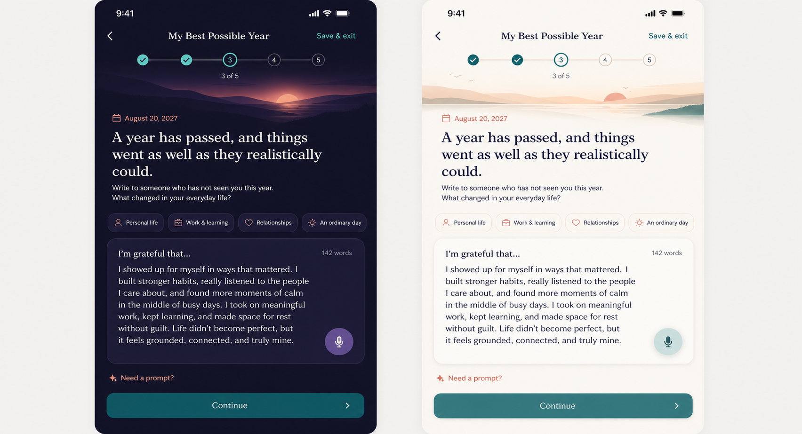

# My Best Possible Year — Product Requirements Document

Status: **Draft PRD; privacy influence is founder-approved in D66, remaining details are not**  
Stage: **MVP candidate**  
Tool type: **Private future-oriented reflection, not prediction or assessment**  
Estimated time: **15–25 minutes; resumable**  
Last updated: 2026-08-21

## Purpose and problem

Short goal forms often begin with constraints and produce transactional lists. People may know what they “should” pursue without being able to picture how a better year would actually feel in ordinary life.

My Best Possible Year creates a calm writing ritual in which the user imagines a future that went as well as it **realistically could**, writes from that date across meaningful life areas, and chooses whether to preserve one aspiration separately as a possible Dream. The value is the reflection itself. PushApp does not read the letter for signals, score optimism, or claim that writing predicts the future.

## Goals

- Help the user form a vivid, grounded picture of a desired year, including an ordinary day—not only achievements.
- Support typing and optional dictation in a quiet, private, resumable writing surface.
- Return the sealed or saved letter on a user-understood date without using its content as product intelligence.
- Allow one separately written aspiration to enter an explicit Dream exploration path, without extracting it from the letter.

## Non-goals

- Predicting outcomes, manifesting, diagnosing wellbeing, or scoring optimism.
- Reading, summarising, classifying, or mining the letter for Coach context.
- Automatically extracting goals or creating Dreams, Journeys, Milestones, Steps, reminders, or notifications.
- Reproducing branded worksheet wording or requiring a celebratory/perfect future.
- Replacing professional mental-health support or encouraging denial of current hardship.

## User stories

- As a user, I want prompts that include everyday life so the future feels lived rather than performative.
- As a private writer, I want confidence that neither the Coach nor analytics reads my letter.
- As someone who cannot finish in one sitting, I want a durable draft and a clear return path.
- As a returning user, I want to read my current letter, continue editing when allowed, or start again.
- As a user who finds one aspiration worth pursuing, I want to type it separately and knowingly explore it as a Dream.

## Entry and return

### First entry

The Tools card states the outcome, `15–25 min`, private-reflection status, and resumability. Orientation explains: the letter stays private; PushApp does not analyse it; difficult feelings are valid; skip any prompt; and the return mechanism is chosen later.

### Return with a draft

Show target future date, covered prompt areas, word count bucket, and last-edited time—never a content excerpt on the Tools landing page. Actions: `Continue writing`, `Review settings`, `Delete draft`, and `Start again` with confirmation.

### Return after completion

The current summary shows creation date, intended return date, and whether it is sealed. If unsealed: `Read`, `Edit`, `Change return date`, `Start again`, `Delete`. If sealed: do not reveal content before the selected return date unless a founder-approved “open early” rule is added; display a calm explanation and permitted settings. Starting again creates a separate draft and must not destroy the sealed letter.

### On the return date

Surface an in-app return card. Whether local notification reminders are offered is an **Open Question**; permission must be optional, generic, and never include letter content. Opening the letter is voluntary and can be postponed without penalty.

## Detailed flow

1. **Orientation and safety.** Explain the exercise, privacy, realistic framing, skip/save/exit, and emotional opt-out. Offer `Begin` and `Not now`.
2. **Choose a future date.** Default suggestion: one year from today. Allow a bounded future range (draft: 3–24 months) and explain that the date controls return context, not a deadline.
3. **Grounding.** Optional brief breathing/imagery instruction with skip and reduced-motion/audio-free alternatives. Do not award XP for participation.
4. **Seed prompts.** Ask the user to imagine what went realistically well, what mattered, what strengths/support helped, and what obstacles were handled. Prompts are optional aids, not mandatory answers.
5. **Write the letter.** A single calm editor addressed to someone who has not seen the user during the year. Prompt chips cover personal life, work and learning, relationships, and an ordinary day. Typing and dictation edit the same text. `Need a prompt?` inserts no content; it reveals an optional question.
6. **Review.** Show the complete letter, future date, and privacy statement. Offer edit, save as an unsealed reflection, or choose a return date and seal.
7. **Separate Dream box.** Optional, clearly separate field: `Is there one aspiration you want to explore as a Dream? Write it here in your own words.` The app does not prefill this from the letter. Submitting opens a confirmation/Coach flow and is the only information allowed to leave the reflection boundary.
8. **Return settings.** Choose in-app return date and optional reminder if approved. Explain postponement and deletion.
9. **Confirm result.** Create a dated, private result and show the return summary. No triumphant claims that the envisioned year will happen.
10. **Return experience.** On/after the date, let the user open, postpone, keep private, export, or delete. Any follow-up reflection is optional and itself private.

## Result and downstream use

The result is the user's private letter plus dates and user-chosen sealed/unsealed state. The letter has **no downstream reader**.

### Approved influence contract — D66

- **What the app learns:** nothing from the reflection content. The writing is for the user.
- **Smallest derived summary:** none from the letter.
- **Permitted readers:** none—not Coach, Home recommendations, notifications, Buddy, Support Circle, analytics, or AI.
- **Only handoff:** a separate aspiration sentence deliberately typed into the Dream box, with explicit knowledge of where it goes. It is not extracted or inferred from the letter.
- **Staleness:** not applicable to influence because no derived insight is used. Stored letters remain personal records subject to user deletion and the eventual retention decision.

The **shape of the return mechanism remains Open Question** under D66. The flow above is a draft specification, not founder approval.

## UX requirements — light and dark

- The writing surface is the visual focus: one large editor, few controls, generous whitespace, and no card-inside-card clutter.
- The concept's horizon image may be implemented as code-drawn theme-aware scenery, consistent with Design System §0.3; do not ship a theme-inflexible screenshot as UI.
- Fraunces/Frank Ruhl Libre display headings and Inter body/controls with stable line-height roles.
- Dark mode uses a deep dusk and readable writing surface; light mode uses restrained sunrise tones and near-white paper. Both meet WCAG AA and preserve cursor/selection visibility.
- Progress shows location, not performance. No red urgency, streaks, scores, or celebratory pressure.
- 44px targets, Dynamic Type, screen-reader editing, RTL, keyboard-safe layout, reduced motion, and a non-audio path are required.
- The seal state and return date require text labels and accessible announcements, never colour-only meaning.

## Data and privacy

- Letter text, prompt responses, dictation output, dates, and drafts are stored on-device by default through the Repository abstraction.
- No letter text, excerpt, inferred topic, sentiment, word, or exact word count enters analytics, logs, crash reports, Coach context, AI prompts, notification content, or Support Circle.
- Dictation must use an explicitly approved platform/privacy path; typed input is always available. Do not retain audio after successful transcription unless the user explicitly creates an audio artifact in a future scope.
- Local notification copy, if approved, is generic: e.g. `A letter you wrote is ready when you are.`
- Provide delete draft, delete letter, export, and account deletion behaviour. Clarify whether sealed content can be exported or opened early.
- Device backup/sync and encryption behaviour must be disclosed before shipping; cloud sync is out unless separately approved.

## Edge cases

- The future date arrives while the app is uninstalled or notifications are denied: the letter appears on next launch without penalty.
- User changes timezone or device clock: use stored absolute date plus local presentation and avoid duplicate return events.
- The chosen date is invalid/too near/too far: explain bounds without framing it as a deadline.
- Draft is empty or very short: allow saving; require only explicit confirmation, never a minimum optimism/word threshold.
- Writing becomes distressing: `Pause and leave` is always available; do not analyse or trigger hidden interventions from text.
- Dictation permission denied, interrupted, or mistranscribed: preserve existing text and fall back to typing.
- User starts a new reflection while one is sealed: keep both distinct; no silent overwrite.
- RTL long-form editing, mixed scripts, emoji, Dynamic Type, and offline restart must preserve cursor and draft.
- Notification fires after deletion: cancellation must be part of deletion acceptance.

## Success metrics and instrumentation

Success means people complete or meaningfully return to a private reflection and trust the boundary—not that PushApp learns from the letter.

- Completion among starts; resume success; proportion choosing a return date; voluntary open/postpone on return; deliberate separate Dream-box handoff.
- Guardrails: privacy-explanation exits, delete rate, notification opt-out, duplicate/missed returns, draft loss, and “open early” demand.

Events (never include letter content, excerpts, prompt choices that reveal content, or exact word count): `tool_best_possible_year_viewed`, `tool_best_possible_year_started`, `best_possible_year_future_date_set`, `best_possible_year_prompt_area_opened`, `best_possible_year_input_mode_used`, `tool_best_possible_year_draft_saved`, `tool_best_possible_year_resumed`, `best_possible_year_review_viewed`, `best_possible_year_return_setting_set`, `best_possible_year_sealed`, `tool_best_possible_year_completed`, `best_possible_year_return_due`, `best_possible_year_return_opened`, `best_possible_year_return_postponed`, `best_possible_year_dream_handoff_started`, `best_possible_year_reminder_permission_result`, `tool_best_possible_year_reset`, `tool_best_possible_year_deleted`, `tool_best_possible_year_error`.

Allowed properties: step, entry source, duration bucket, input mode, coarse word-count bucket, future-date distance bucket, sealed state, reminder enabled, return action, language, theme, and error code. `return_due` is local instrumentation and must not include user content.

## Acceptance criteria

- Entry clearly labels a private reflection, duration, resumability, and no-content-analysis promise.
- The complete writing flow works by typing; dictation is optional and failure-safe.
- The user can save/exit/resume without content loss and can delete drafts/results.
- No component reads the letter except the user-facing editor/result; code and analytics audits verify the boundary.
- The Dream box is empty by default, separate, manually authored, and requires visible confirmation before handoff.
- A return date can be set, changed where allowed, opened voluntarily, or postponed without penalty.
- Deletion cancels any associated local reminder and removes the letter from result lists.
- Light/dark, English/Hebrew RTL, Dynamic Type, screen reader, reduced motion, offline, timezone-change, and force-close tests pass.

## Test scenarios

1. Type a long letter, save/force-close at each step, relaunch offline, and confirm exact recovery.
2. Deny dictation permission, interrupt transcription, and finish by typing without losing prior text.
3. Complete without selecting every prompt area and with a very short, ambivalent letter.
4. Leave Dream box empty; verify no downstream object or Coach context exists.
5. Type a separate aspiration, cancel at confirmation, then confirm later; verify only that sentence crosses the boundary.
6. Seal a letter, start another draft, delete each independently, and ensure reminders cancel correctly.
7. Advance across return date with timezone/device-clock changes and notifications denied; verify one in-app return.
8. Postpone return multiple times without penalty or urgency.
9. Inspect analytics, logs, crash payloads, notifications, and Coach prompts to prove no letter content or inference escapes.
10. Test both themes, large text, screen reader, mixed RTL/LTR long-form editing, emoji, and reduced motion.

## Competitors and references

- [Future Yourself](https://futureyourself.app/index.html): useful scheduled-return, archive, media, and privacy patterns; PushApp should avoid turning private reflection into engagement reminders.
- [Best Possible Self meta-analysis](https://pmc.ncbi.nlm.nih.gov/articles/PMC6756746/): a 29-study meta-analysis reported benefits for wellbeing, optimism, and positive affect versus controls; this supports offering the exercise, not promising an individual outcome.
- [Online writing and imagery format comparison](https://www.sciencedirect.com/science/article/pii/S0005791623000046): reference for delivery-format considerations.
- Internal research: `05_Research/Coaching_Tools_Digitization_Competitive_Research_2026-08-20.md` §3.6.
- Governing decision: `06_Decisions/Decision_Log.md` D66; `04_Product/Tool_Addition_Protocol.md` §4b; `04_Product/Design_System.md`.

## Related tasks

- **Open founder task from D66:** decide the final return mechanism, including sealed/open-early behaviour and reminders.
- **Draft / unassigned:** write original bilingual prompts and emotionally safe orientation copy.
- **Draft / unassigned:** complete privacy/security review for local storage, dictation, export, backup, deletion, and reminders.
- **Draft / unassigned:** implement the reflection boundary and automated tests proving no reader receives letter content.
- **Draft / unassigned:** implement and QA analytics events above without content leakage.

## Product decisions

- **Approved — D66:** this reflection is for the user and teaches PushApp nothing from its content.
- **Approved — D66:** only a separate aspiration deliberately typed into the Dream box may be handed over; the letter is never read or mined.
- **Approved, repository-wide:** Tools never silently create objects, nag, score, grade, compare, or send raw answers.
- **Research recommendation, not founder-approved:** build as a realistic future-letter ritual with optional dictation and an ordinary-day prompt.

## Future Vision

- User-owned audio or imagery, only with explicit privacy and storage decisions.
- Multiple dated letters and user-led comparison without system interpretation.
- Private export/print and an optional return ritual that does not mine content.

## Open Questions

- What exactly is the return mechanism: in-app only, optional local reminder, seal, open early, postpone, or a combination?
- What future-date bounds and retention policy should apply?
- Should completed letters remain editable or become immutable snapshots?
- How are local backups, device migration, encryption, and export handled before shipping?
- Is dictation acceptable for MVP under the product's privacy promise, and which platform path qualifies?
