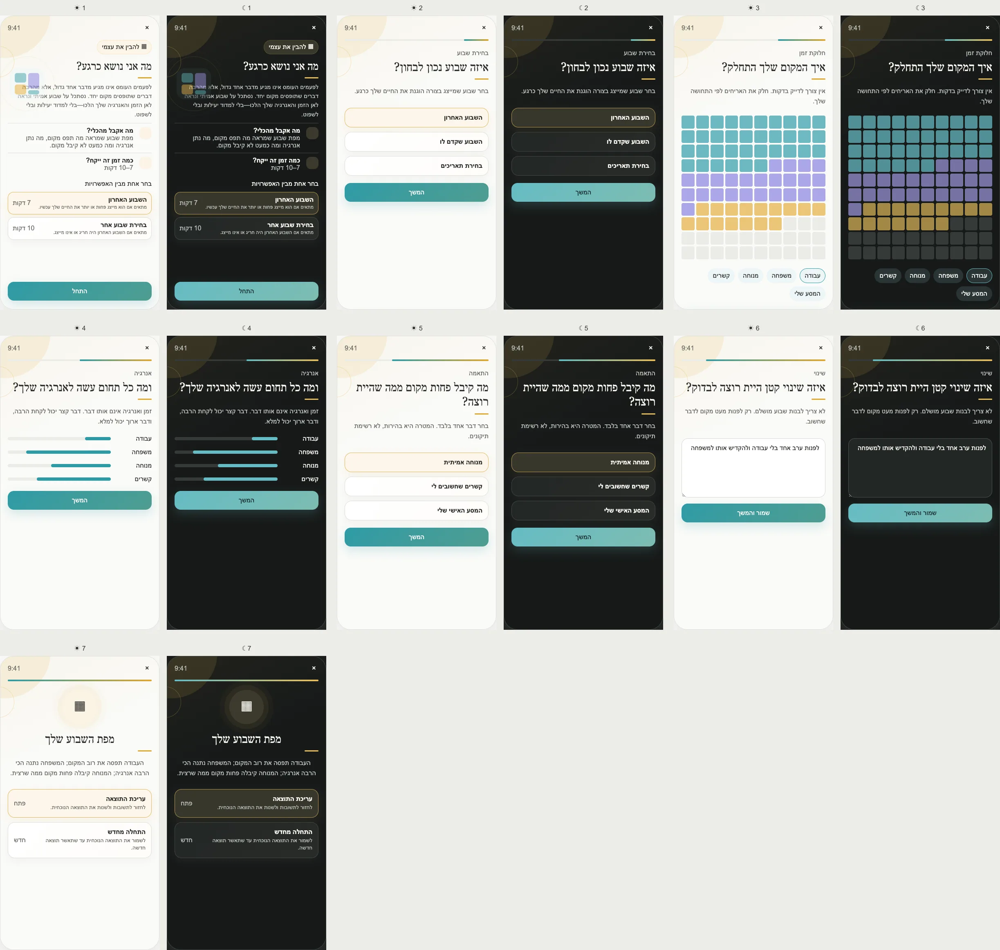

# PRD — What Am I Carrying Right Now?

Status: **Founder-approved product and UX specification; ready for implementation planning.**
Stage: **POC**.
Type: **Time-bounded self-reflection**, not time tracking or productivity scoring.
Surface: **Tools → Understand Myself → What Am I Carrying Right Now?**
Reference: [Personal Projects Analysis](https://www.brianrlittle.com/research/).

---

## Design reference

## 1. Purpose

Help a user examine one representative recent week and notice how their time and energy were distributed, what
received too little space, and one small reallocation they would like to test.

The Tool must not become a calendar, time tracker, task manager, optimization score, or judgment about how a
person “should” spend a week.

## 2. Product problem

People experience overload as a vague feeling. Exact time tracking creates work and false precision; asking
about life “in general” produces abstractions. A bounded representative week is concrete enough to recall and
honest enough to discuss.

## 3. User outcome

A dated map showing:

- broad time allocation;
- which areas gave or consumed energy;
- one personally important area that received too little space;
- one user-authored reallocation experiment.

Estimated duration:

- last representative week: **7 minutes**;
- choose another week: **10 minutes**.

## 4. Opening options

The opening screen includes **Choose one of the options**:

1. **Last week** — appropriate when it roughly represents current life; 7 minutes.
2. **Choose another week** — appropriate when last week was exceptional; 10 minutes.

Start remains visible without scrolling. A selected week must be a completed seven-day interval within the
last 30 days. The current partial week is not presented as a complete representative week.

## 5. Allocation model

The user distributes **100 visual tiles** across broad areas. Tiles communicate part-to-whole without asking
for exact hours. Initial categories:

- work/study;
- family/caregiving;
- health;
- relationships;
- Dreams/Journeys;
- rest/leisure;
- errands/obligations;
- unplanned/dispersed time;
- custom area.

The categories are editable labels for reflection, not canonical app objects. Journey activity may be offered
as a shortcut but is never imported silently.

## 6. Energy and alignment

After allocation, ask separately:

1. **Energy effect:** depleted / neutral / gave energy, with a simple continuum.
2. **Personal alignment:** which one area received less space than the user wanted?
3. **Small reallocation:** “If you moved a little space next week, where would it come from and where would it
   go?”

Time and energy stay separate. Large time does not equal bad; low time does not equal unimportant.

## 7. Approved screen inventory

1. **Opening:** value, two routes with descriptions/times, Start visible.
2. **Week choice:** last week, previous week, or eligible date range.
3. **Time allocation:** 100-tile mosaic and category controls.
4. **Energy:** one rating per used category.
5. **Under-allocated area:** choose one, with **None right now** available.
6. **Small shift:** optional user-authored experiment.
7. **Result:** allocation, energy, missing-space observation, and chosen experiment.

## 8. Returning and history

Entry opens the latest confirmed result. Actions: View, Edit labels/interpretation, Repeat for a new week, and
Delete. Repeating creates a new dated result; it does not overwrite prior weeks unless the retention policy
later limits history with user-visible notice.

Do not produce trend claims from fewer than three comparable completed weeks. Different weeks may be marked
non-comparable by the user.

## 9. Influence contract

### What becomes knowable

A user-described snapshot of one week's allocation and energy, plus one under-allocated priority and optional
experiment.

### Smallest derived summary

`{ weekStart, weekEnd, dominantAreaCodes[], energizingAreaCodes[], drainingAreaCodes[], underAllocatedCode?, hasExperiment }`

Custom labels and free text remain private Tool data.

### Permitted consumers

- Tool result and history;
- Coach only after **Discuss this week with the Coach**, sending a previewed coarse summary plus any exact text
  the user explicitly selects;
- Weekly Review may link to the Tool but does not ingest its result automatically.

### Prohibited automatic effects

Never create, freeze, resume, reschedule, or reprioritize a Dream, Journey, Milestone, Step, reminder, or
weekly plan. Never label the user productive, lazy, balanced, or overloaded.

### Freshness

Every result is permanently tied to its week. It expires as current context after **30 days** but remains valid
history.

## 10. Data model

Suggested `CurrentLoadSnapshot`:

- `id`, `ownerId`, `weekStart`, `weekEnd`, `representative: yes | no | unsure`;
- `allocations[] { categoryCode, customLabel?, units }`, totaling 100;
- `energyRatings[] { categoryCode, rating }`;
- `underAllocatedCategory?`, `experimentText?`;
- `status`, `confirmedAt`, `schemaVersion`, `locale`.

## 11. Edge cases

- Allocation below/above 100: show remaining/excess tiles and block confirmation, not draft saving.
- User cannot remember: allow rough ranges and **Not sure**; never fabricate precision.
- Exceptional last week: encourage another week without invalidating the user's choice.
- Multiple jobs/care roles: allow custom categories and merging.
- No under-allocated area: valid result.
- Week spans timezone change or travel: preserve the selected calendar dates in the timezone used at entry.
- Offline: full Tool works; sync conflicts keep both snapshots until resolved.
- Accessibility: tile allocation also has plus/minus controls and numeric summaries; drag is never required.

## 12. UX and visual rules

- Color family: **warm amber / self-understanding**; it must not resemble a warning.
- Use one calm mosaic, not charts competing with one another.
- Categories use labels and stable visual marks; color is not the only cue.
- The opening illustration sits in the background and Start remains visible without scrolling.
- Light/dark modes maintain equivalent tile distinction and text contrast.

## 13. Privacy and analytics

Raw allocations, custom labels, energy ratings, and experiments are private. General analytics may record Tool
start/completion, selected route, number of categories, and whether an optional experiment exists—never its
content.

Scoped deletion removes selected snapshots. Account deletion removes all history.

## 14. Acceptance criteria

- A user can complete the Tool without exact hours, calendar access, or Journey data.
- Allocation always resolves to 100 units before confirmation.
- The result never generates an optimization score or automatic product change.
- Seven screens, opening fit, RTL, light/dark, accessible non-drag controls, history, deletion, and offline
  behavior are tested.

