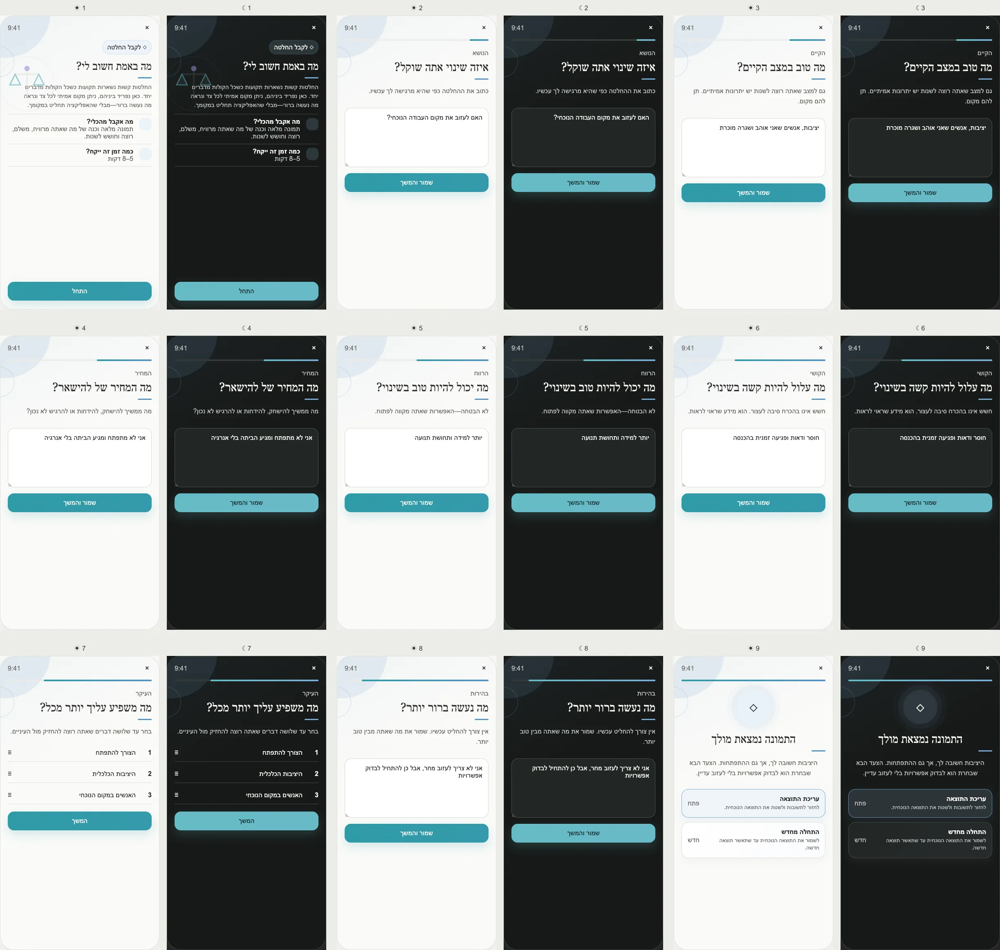

# PRD — What Really Matters to Me?

Status: **Founder-approved product and UX specification; ready for implementation planning.**
Stage: **POC**.
Type: **Decision reflection**, not advice, therapy, or an automated recommendation.
Surface: **Tools → Make a Decision → What Really Matters to Me?**
References: [Motivational Interviewing Network of Trainers decisional balance](https://motivationalinterviewing.org/decisional-balance-worksheet),
[NYU decisional balance reference](https://publichealth.nyu.edu/w/nyctt/clinicaltools/decisionalbalance), and
[MI Coach digital reference](https://www.resiliens.com/en/mi-coach).

---

## Design reference

## 1. Purpose

Help a user separate competing considerations in one difficult change, identify what weighs most heavily, and
write what became clearer—without PushApp deciding, scoring, or steering the outcome.

## 2. Product problem and differentiation

Ambivalence is not a lack of motivation; it often means both sides contain something real. Digital tools
commonly show a four-box pros/cons worksheet and then add readiness scores or prescriptive advice. PushApp
preserves the honest four-sided view but reveals one side at a time, avoids a numerical verdict, and ends with
the user's own clarity statement.

## 3. User outcome

The user leaves with:

- the benefits and costs of the current situation;
- the hoped-for benefits and anticipated costs of change;
- up to three personally important considerations;
- one private statement of what is clearer now.

Estimated duration: **5–8 minutes**.

## 4. Opening

The opening screen presents the value, target icon, clock icon, estimated time, and a visible Start button
without scrolling. There are no routes to choose because one complete method serves the Tool's purpose.

User-facing copy must say that there is no correct answer and that the Tool will not decide for the user.

## 5. Approved screen inventory

1. **Opening:** purpose, expected result, time, Start.
2. **Decision topic:** “What change are you considering?”
3. **Benefits of the current situation:** include real needs it currently meets.
4. **Costs of the current situation.**
5. **Potential benefits of change:** possibilities, not promises.
6. **Potential costs/difficulties of change.**
7. **What matters most:** select and order up to three authored considerations.
8. **Clarity statement:** “What became clearer?”; deciding now is not required.
9. **Result:** balanced summary, clarity statement, Edit, Start over, and optional Coach discussion.

Each writing screen permits multiple short entries or one free-text answer. The implementation must preserve
the four semantic groups rather than collapsing them into one positive/negative score.

## 6. Neutrality rules

- Do not count entries and declare one side the winner.
- Do not weight emotionally intense words as stronger evidence.
- Do not label the user resistant, avoidant, ready, or unready.
- Do not use dark patterns to favor change or the status quo.
- Do not transform a fear into a barrier diagnosis.
- The order of the four sides is fixed for consistency but copy validates every side.

The Tool may offer **Discuss this with the Coach** after the result. The conversation receives only a previewed,
user-approved result; it must continue motivational-interviewing neutrality and cannot implement a decision.

## 7. Returning behavior

Return opens the confirmed result. Actions:

- Edit current reflection through a draft;
- Start a new decision reflection;
- Discuss this result with the Coach;
- delete the result.

Several decision results may coexist because each belongs to a different question. The Tool does not create a
permanent “decision profile.”

## 8. Influence contract

### What becomes knowable

The user's private articulation of one decision and a user-confirmed clarity statement.

### Smallest derived summary

`{ resultId, confirmedAt, hasStatusQuoBenefits, hasStatusQuoCosts, hasChangeBenefits, hasChangeCosts, selectedConsiderationCount, hasClarityStatement }`

No side content, decision topic, or inferred direction enters general analytics.

### Permitted consumers

- Tool result: full private content;
- Coach: only after the user previews and confirms sharing this specific result.

### Prohibited automatic effects

Never create or change a Dream, Journey, Milestone, Step, Friend/Ally relationship, plan, reminder, or account
setting. Never state which option the user should choose.

### Freshness

The result is dated and stops being offered as current Coach context after **30 days**. It remains private
history until deletion.

## 9. Data model

Suggested `DecisionReflection`:

- `id`, `ownerId`, encrypted `topic`;
- encrypted arrays: `statusQuoBenefits`, `statusQuoCosts`, `changeBenefits`, `changeCosts`;
- `priorityItemRefs[]` and encrypted `clarityStatement`;
- `status: draft | confirmed | superseded`, `confirmedAt`, `schemaVersion`, `locale`.

References point to entries within the result; they are not independent analytics entities.

## 10. Edge cases and safety

- One or more empty quadrants: completion is allowed after a neutral “Nothing comes to mind right now” choice.
- Immediate decision deadline: do not invent urgency; the user may finish with a partial result.
- Decision involving abuse, self-harm, medical/legal/financial stakes: the Tool remains reflective and shows the
  relevant shared safety/professional-help boundary; it does not advise.
- Decision about another person: avoid inferring their motives or consent.
- User changes the decision question mid-flow: ask whether to restart, because existing answers may no longer
  belong to the same decision.
- Coach unavailable: preserve result and keep the Tool complete.
- Offline: full manual reflection works; Coach action waits for connection.
- Deletion removes only this reflection and never alters the underlying real-world choice.

## 11. UX, color, and accessibility

- Color family: **calm blue / clarity and perspective**; no green/red sides.
- Reveal one quadrant per screen; show the complete four-part layout only when it helps integrate the result.
- Selected considerations are ordered by accessible buttons as well as drag.
- Start is visible without scrolling; the opening illustration is background decoration.
- Light/dark modes preserve neutral parity between all four sides.
- No score, percentage, readiness gauge, countdown, or celebratory “correct decision” state.

## 12. Privacy and analytics

Decision content is high-sensitivity private reflection. Raw text remains private and is shared only in a
specific, user-initiated Coach action with a preview. Analytics may capture structural completion and counts,
never topic, sides, priorities, clarity text, or inferred direction.

## 13. Acceptance criteria

- The four sides receive equal interaction and visual weight.
- No computation produces a recommended decision.
- Opening Start fits without scrolling.
- All nine screens, light/dark, RTL, empty/partial states, reorder alternative, offline, Coach opt-in, reset,
  and deletion are tested.

