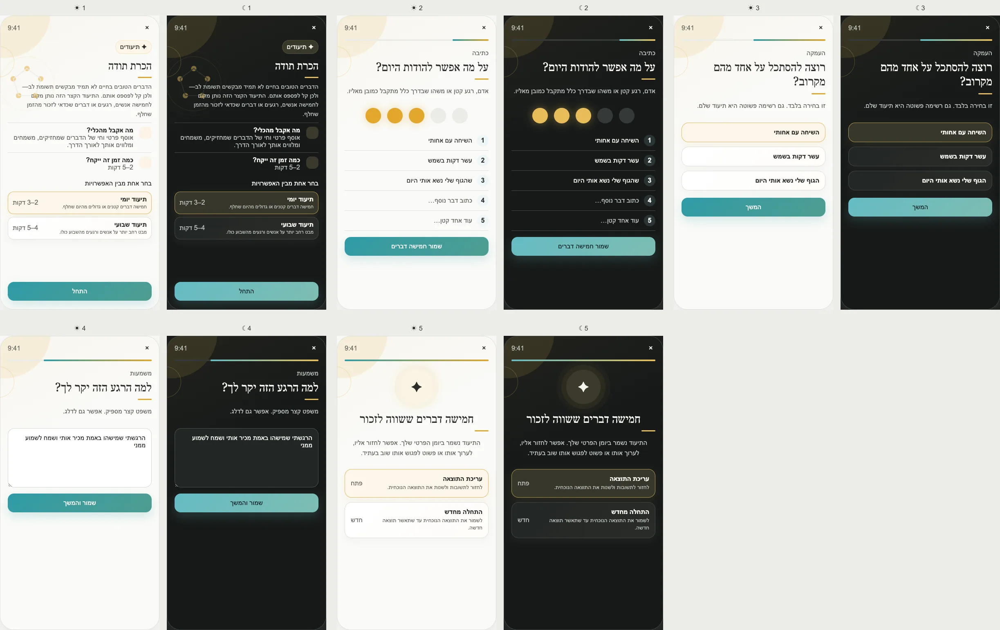

# PRD — Gratitude Log

Status: **Founder-approved product and UX specification; ready for implementation planning.**
Stage: **POC**.
Type: **Private recurring record**.
Surface: **Tools → Records → Gratitude**.
References: [Three Good Things](https://ggia.berkeley.edu/practice/three-good-things),
[Five Minute Journal](https://www.intelligentchange.com/pages/five-minute-journal-lp), and the
[Five Things digital reference](https://apps.apple.com/us/app/five-things-daily-journal/id6761477567).

---

## Design reference

## 1. Purpose

Give the user a short private daily or weekly ritual for recording at least five people, moments, experiences,
or ordinary things they appreciate from the period that just passed.

The Tool creates a record worth revisiting. It does not demand optimism, replace difficult feelings, create a
public feed, or reward repetition with streak pressure.

## 2. Product problem and differentiation

Digital gratitude journals commonly combine three prompts with streaks, generic reminders, public sharing, or
word-cloud analysis. PushApp uses five entries to create a richer pause, offers varied prompts to avoid rote
answers, supports daily and weekly rhythms, and keeps the record private without scoring or mining it.

## 3. Opening options

Show **Choose one of the options**:

1. **Daily record** — five small or large things from the day; approximately 2–3 minutes.
2. **Weekly record** — a broader look at people and moments from the week; approximately 4–5 minutes.

The selected cadence becomes the default next time and can be changed at any time. It is not a commitment.
Start remains visible without scrolling.

## 4. Entry model

- Minimum for a confirmed record: **five non-empty entries**.
- The user may add more than five; the initial POC cap is **ten** to keep the ritual bounded.
- Each entry is a short line, with an optional longer “why this mattered” note for one selected entry.
- Suggestions rotate among people, small moments, body/health, places, opportunities, learning, help received,
  nature, comfort, and things usually taken for granted.
- Suggestions are optional and never become saved text until the user writes or selects them.

## 5. Approved screen inventory

1. **Opening:** value, daily/weekly routes with descriptions/times, Start.
2. **Five entries:** one spacious list, five illuminated progress points, optional prompt suggestions.
3. **Optional deepening:** choose one recorded item or skip.
4. **Why it mattered:** one optional short note.
5. **Result:** five-or-more-item record, private-history explanation, Edit and Start a new record.

## 6. Returning and history

Returning opens:

- an incomplete current-period draft, if one exists; otherwise
- the latest confirmed record, with **Write this period's record** when appropriate.

History supports date/week navigation and **Return to this moment**, which surfaces a past confirmed record
without pretending it was randomly selected for a psychological reason.

Rules:

- no streak;
- no red missed days;
- no catch-up requirement;
- no automatic backfilling;
- only one confirmed record per cadence/period, with editable drafts;
- switching cadence preserves prior history.

## 7. Reminder behavior

Optional reminders use the shared reminders and active-hours rules. Default is off unless the user explicitly
enables it. Copy is invitational, not guilt-based. Missing or dismissing a reminder has no product consequence.

Daily and weekly cadence each have their own preferred time but cannot bypass global active hours.

## 8. Influence contract

### What becomes knowable

Nothing enters the general user model. Under Decision D66, gratitude writing is for the user.

### Permitted consumers

- Tool record and private history only;
- export/account download under the shared data-export contract.

The Coach, Dreams, Journeys, Weekly Review, motivation engine, notifications, Friends, Allies, Support Circle,
and recommendation systems do not read, summarize, classify, or quote entries.

### Prohibited automatic effects

Never infer mood, relationships, values, life satisfaction, health, or recurring themes. Never turn entries into
Dreams, Steps, motivation messages, or social posts.

### Freshness

Every record is a dated memory, not current context. It does not expire as history and is never treated as a
current user fact.

## 9. Data model

Suggested entities:

- `GratitudePreference { ownerId, defaultCadence, dailyReminder?, weeklyReminder?, updatedAt }`;
- `GratitudeRecord { id, ownerId, cadence, periodStart, periodEnd, status, confirmedAt, updatedAt }`;
- `GratitudeEntry { id, recordId, order, encryptedText, encryptedWhyNote? }`.

Use user-perceived character limits and visible counters. Proposed POC limits:

- entry: 120 characters;
- optional why note: 300 characters.

## 10. Edge cases

- Fewer than five entries: save draft, do not confirm; never shame or discard.
- Duplicate entries: allowed; gratitude can repeat.
- Difficult period: prompts allow “something small that helped” without denying hardship; user may leave.
- Timezone change: a draft belongs to the local period in which it was created; do not silently reassign it.
- Daily and weekly overlap: both may coexist if the user deliberately changes cadence; do not duplicate content.
- Edit past record: preserve original period and add updated timestamp.
- Offline: entry, history, edit, and delete work; conflicts preserve both drafts for resolution.
- Sensitive third-party information: remain encrypted/private and excluded from analytics.
- Empty history: warm invitation, no “you have not started a streak” language.

## 11. UX, color, and accessibility

- Color family: **warm gold / records and appreciation**; not Coins or reward currency. Use a softer tint and a
  distinct star/constellation motif to avoid game-economy confusion.
- Five lights indicate completion structure, not a score.
- Opening illustration remains in the background and Start is visible without scrolling.
- Light/dark modes preserve the glow without reducing text contrast.
- The list is fully keyboard/screen-reader accessible; light state is paired with numbered text.
- Reduced motion removes glow transitions.

## 12. Privacy, analytics, export, and deletion

Raw entries and notes are encrypted private reflection content. Analytics may record cadence choice, draft/
confirmation, and entry count bucket only. Never log text, themes, named people, or reminder response as an
emotional signal.

The user can delete one entry, one record, all Gratitude history, or the account. Export includes the user's
records in a readable dated form.

## 13. Acceptance criteria

- Daily and weekly routes have descriptions, independent time estimates, and a visible Start action.
- Confirmation requires five entries; draft saving never does.
- No missed-day penalty, streak, public feed, or automatic analysis exists.
- All five screens, cadence switching, history, reminders, light/dark, RTL, reduced motion, offline, export,
  edit, and deletion are tested.

