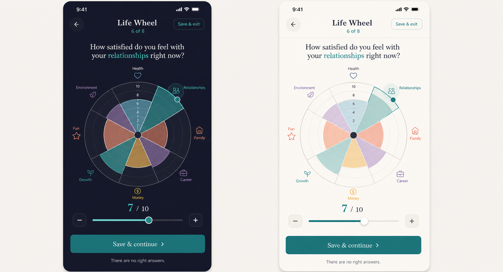

# PRD — Life Wheel

Status: **Draft specification; the Life Wheel influence contract is founder-established, while the detailed flow and UX below require approval.**  
Stage: **MVP candidate**  
Surface: **Tools → Life Wheel**  
Category: **Know yourself**  
Estimated time: **8 minutes; resumable**

## 1. Purpose and product problem

The Life Wheel gives a person a dated, visual reading of where life feels supported and where an important
area is quietly costing them. It solves the limits of flat interest lists: interest does not reveal the gap
between how an area is going and how much it matters.

This is a guided reflection, not a diagnostic assessment. It aligns with PushApp because it can help a person
name a real aspiration and take it to the Coach; it must not optimize for repeated scoring or time in app.

### Feature-proposal checklist

- **Problem:** a person senses imbalance but cannot see which gap deserves attention.
- **Why needed:** a bounded visual reflection makes trade-offs visible and gives the Coach useful, volunteered
  context.
- **Improves:** Tools, Coach context, and optional Dream exploration.
- **Complexity:** radial input, two ratings per domain, autosave, snapshot history, accessibility, and a
  tightly controlled influence contract.
- **Philosophy fit:** insight is useful only when it supports chosen real-life growth; no score, grade, or nag.
- **Stage:** MVP candidate; sequencing remains an Open Question.

## 2. Goals and success signals

Goals:

1. Let the user rate eight life areas quickly without implying a correct shape.
2. Reveal the difference between present satisfaction and personal importance.
3. Help the user choose up to three areas, then one current priority.
4. Offer a Coach conversation or Dream exploration without creating or changing anything automatically.

Primary success signal: a completed reading leads the user to confirm a priority they recognise as useful.
Secondary signal: users who choose the Coach/Dream handoff continue into that flow and explicitly accept or
reject the proposal. Completion rate is diagnostic, not the product outcome.

### Analytics events to instrument

Do not include domain labels, ratings, free text, or derived area names in analytics properties.

| Event | Properties |
|---|---|
| `tool_life_wheel_opened` | `entry_point`, `has_confirmed_result`, `has_draft` |
| `tool_life_wheel_started` | `locale`, `theme` |
| `tool_life_wheel_domain_completed` | `domain_index`, `completed_count` |
| `tool_life_wheel_saved_exit` | `domain_index`, `elapsed_bucket` |
| `tool_life_wheel_resumed` | `domain_index`, `days_since_save_bucket` |
| `tool_life_wheel_priority_confirmed` | `selected_area_count`, `elapsed_bucket` |
| `tool_life_wheel_result_viewed` | `result_age_bucket`, `is_repeat_snapshot` |
| `tool_life_wheel_handoff_selected` | `destination: coach|dream` |
| `tool_life_wheel_handoff_outcome` | `destination`, `outcome: accepted|declined|abandoned` |
| `tool_life_wheel_reset_confirmed` | `had_confirmed_result` |
| `tool_life_wheel_deleted` | `scope: draft|snapshot|all` |

## 3. Non-goals

- Diagnosing wellbeing, assigning a global life score, or comparing users.
- Creating a Dream, Journey, Step, reminder, or Coach agenda automatically.
- Treating a low rating as failure, urgency, or permission to notify the user.
- Sharing raw answers with the Coach, Allies, Support Circle, or analytics.
- Replacing professional health, financial, relationship, or career advice.

## 4. Entry and return behavior

First entry opens an orientation screen: `8 areas · about 8 minutes`, explains the two ratings, states that
there are no right answers, and offers **Begin** / **Not now**. Each completed input autosaves.

An unfinished reading resumes on the last incomplete area, with **Start over** available behind confirmation.
A returning user with a result lands on the latest dated summary and can **Review areas**, **Compare readings**
(when at least two exist), **Talk to Coach**, **Explore as a Dream**, **Take again**, or **Delete**. Taking it
again creates a new draft and never overwrites the current result before confirmation.

## 5. Detailed flow

### 5.1 Orientation

Explain that each of eight areas is asked twice: `How is this going right now?` and `How much does this matter
to you right now?` Both use 1–10, with anchored endpoints in words. The eight-area set and exact original
wording require content approval; the concept image currently shows Health, Relationships, Family, Career,
Money, Growth, Fun, and Environment.

### 5.2 Rate each area

One area is active at a time. The wheel updates directly as the user taps/drags its radial handle; plus/minus
buttons and an accessible stepper provide equivalent input. A visible numeric value and spoken label ensure
meaning is never color-only. After satisfaction, the same area asks importance. **Save & continue** advances;
Back preserves later answers.

### 5.3 Review the whole wheel

Show both readings without visual overload: satisfaction is the primary filled shape; importance is an
accessible outline/marker layer and can be toggled. The user can revisit any area. PushApp explains that the
gap is information, not a grade.

### 5.4 Choose focus

The user chooses up to three areas they want to advance, then one current priority. The calculated pressing
area may be presented first as a suggestion with a short explanation, but the user's choice wins. Ties are
shown neutrally and never broken invisibly.

### 5.5 Confirm

Before saving, show the selected priority, the strongest area, the date, and what can happen next. The user
confirms the reading; only then does it become current.

## 6. Result and downstream use

The result contains the dated wheel, chosen focus areas, one priority, strongest area, and optional comparison
with a previous snapshot. Change is described neutrally: `Your reading changed`, never `improved/declined`
unless the user uses that language.

### Approved influence contract

Per `Tool_Addition_Protocol.md`, the smallest derived summary is
`{ takenAt, pressingArea, pressingGap, strongestArea }`. Raw ratings remain on device. Permitted readers:

- **Coach:** opening context only; never an agenda.
- **A later “which area?” question:** may offer the pressing area first.
- **Dream exploration:** the pressing area may be offered as a Dream, one tap, never inserted.
- **Nobody else:** not Home, notifications, Buddy, Allies, or Support Circle.

The summary becomes stale after **90 days**. The record may remain visible to the user but must stop
influencing permitted readers.

## 7. UX specification — light and dark

The supplied image is a **design concept, not implementation approval**. Both themes use the same hierarchy:
display-serif title/question (Fraunces in English, Frank Ruhl Libre in Hebrew), Inter controls, one large
radial focus, generous whitespace, 44px minimum targets, and explicit labels. Teal marks the active control;
other area colours aid navigation only and cannot carry meaning alone.

- **Light:** near-white background, white surfaces with hairline edges, dark ink, restrained translucent
  segments, and teal primary action.
- **Dark:** deep neutral/navy background, distinct raised surface/edge, high-contrast labels, desaturated
  translucent segments, and no glow that obscures grid lines.
- RTL mirrors navigation and text alignment, but the chart's domain order must remain stable within a saved
  snapshot. Dynamic Type may move labels into a keyed list below the chart. Reduced Motion disables animated
  morphing between areas/readings.

## 8. Data, privacy, retention

Draft answers, raw ratings, chosen focus, and snapshots are on-device by default. Analytics contains only the
non-content events above. Export and deletion must include both raw readings and derived summaries. The user
can delete one snapshot, the draft, or all Life Wheel data. No Coach access beyond the approved coarse summary;
no server transmission of raw answers. Snapshot-retention duration beyond user deletion is an Open Question.

## 9. Edge cases

- Missing one of the two ratings: keep draft; do not derive a gap.
- All ratings equal or all gaps equal: say no single area stands out and let the user choose.
- Calculated pressing area differs from chosen priority: preserve both; downstream Dream offer uses the user's
  confirmed choice unless the influence contract is explicitly amended.
- Slider/drag inaccessible: stepper and direct numeric selection are fully equivalent.
- Label collision at large text or in Hebrew: replace perimeter labels with numbered markers plus legend.
- Interrupted or old draft: resume without applying; allow discard.
- Previous snapshot deleted: comparison disappears without reconstructing it from analytics.
- Stale summary: visible in history, unavailable to downstream readers.

## 10. Acceptance criteria

1. The user can complete eight areas with two 1–10 ratings each, edit them, and choose up to three focuses plus
   one priority.
2. Every operation autosaves; resuming restores exact progress; restart cannot erase a confirmed result.
3. The wheel is operable without drag, color, animation, or visual chart interpretation.
4. Confirmation creates a dated result and the exact coarse summary; no raw value enters analytics or Coach
   context.
5. No Dream/Journey/Step/reminder is created without a separate explicit user action and confirmation.
6. The 90-day stale rule is enforced for all permitted readers.
7. Light, dark, RTL, Dynamic Type, VoiceOver/TalkBack, and reduced-motion states meet the shared Design System.
8. Delete/export include draft, snapshots, and derived summary.

## 11. Test scenarios

- Complete normally; verify calculations, focus selection, confirmation, and result.
- Save after area 3, relaunch, resume, go back, edit area 2, and finish.
- Produce tied gaps and verify neutral handling and user choice.
- Attempt Dream handoff, decline proposal, and verify nothing was created.
- Advance device time beyond 90 days and verify downstream readers receive no signal.
- Delete one snapshot and all data; verify local state, comparison, export, and analytics payloads.
- Complete using screen reader and buttons only in English/Hebrew, light/dark, largest supported type.
- Inspect every analytics payload for labels, ratings, and derived content.

## 12. Competitors and references

- [Wheeloflife.io](https://wheeloflife.io/) — interactive radial assessment and action-plan starting point.
- [LifeWheel for coaches](https://lifewheel.us/for-coaches/) — assessment history, printable results, privacy,
  and coach sharing.
- Internal research: `../../../05_Research/Coaching_Tools_Digitization_Competitive_Research_2026-08-20.md`
  §3.1.

Best pattern to borrow: direct radial manipulation plus dated comparison. Avoid turning the flow into a long
slider form or presenting the wheel as objective truth. PushApp improves the pattern through a bounded,
auditable handoff to Coach/Dream exploration.

## 13. Related tasks and dependencies

- Tools catalogue/detail copy and the founder-supplied Tools tab design (do not restyle from rejected concepts).
- Local tool store, pure reading model, and `signals.ts` per `Tool_Addition_Protocol.md`.
- Coach context permission enforcement and Dream proposal flow.
- Export/deletion, localization/RTL, accessibility, and analytics QA.
- Snapshot retention decision.

## 14. Decision register

### Product Decisions (Approved)

- Every tool must give user value and have an explicit influence contract.
- Life Wheel uses eight minutes, is resumable, and yields the approved four-field summary.
- Its readers and 90-day staleness are exactly those in §6; raw answers remain on device.
- It may offer a pressing area as a Dream but never create anything automatically.

### Future Vision

- Dated snapshot comparison after at least two confirmed readings.
- Configurable domain sets only if comparability, wording, and accessibility remain honest.

### Open Questions

- Is Life Wheel the first of the four MVP candidates to implement?
- What exact eight domain names and original descriptions ship in English and Hebrew?
- Should confirmed snapshots persist indefinitely until user deletion or follow a retention limit?
- Does downstream Dream ordering use calculated `pressingArea` or the user's separately confirmed priority?

