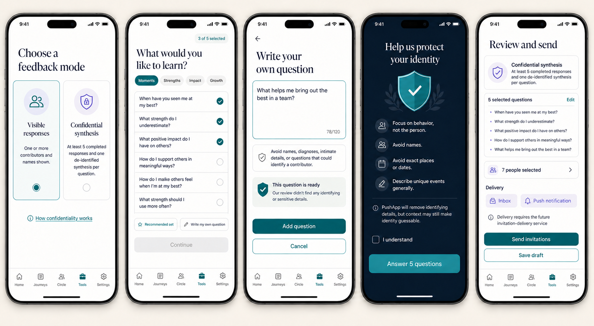
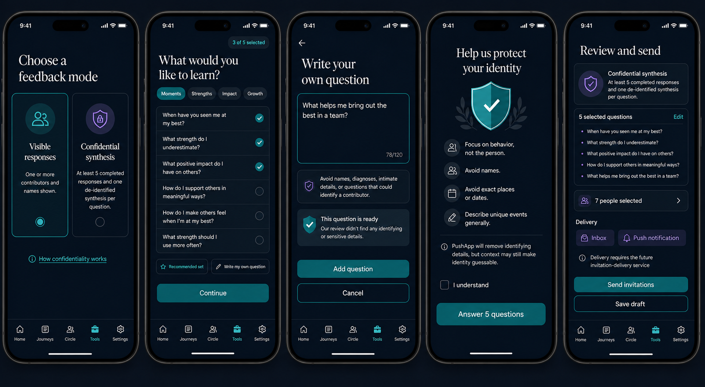
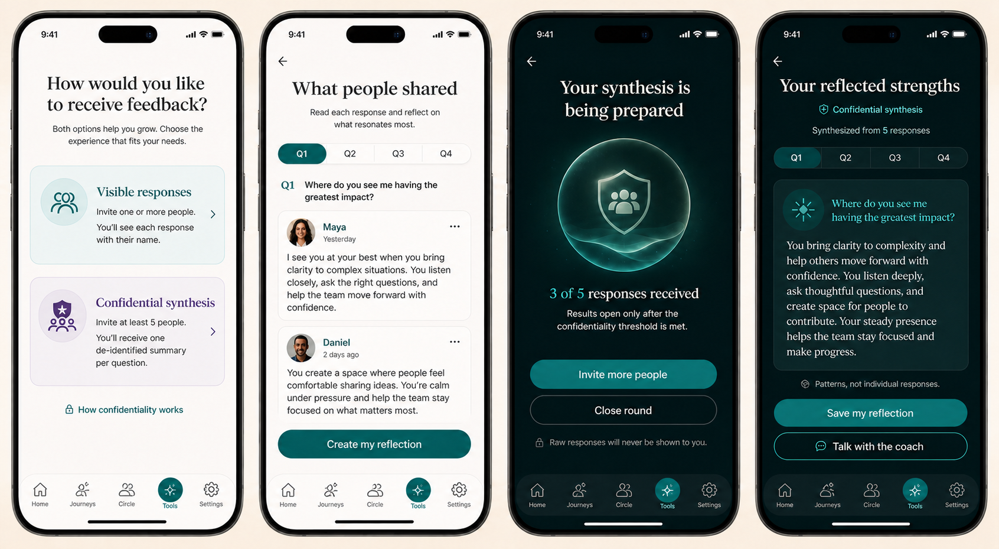
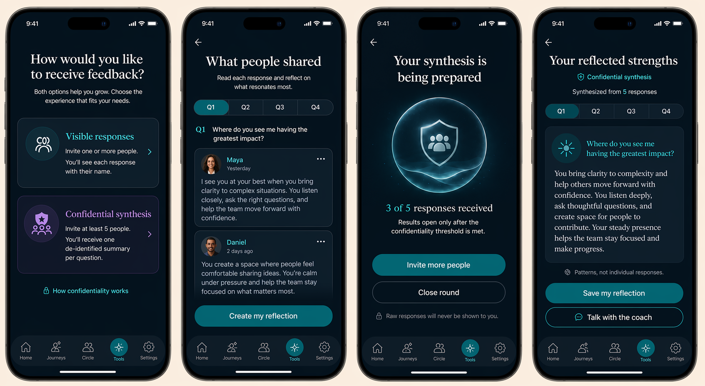

# PRD — Mirror Feedback

Status: **Founder-directed product and UX specification; ready for implementation planning only after the
security/privacy and invitation-delivery gates in §16 are resolved.**
Stage: **Future / sensitive**.
Type: **Social reflection**, not an assessment.
Surface: **Tools → Mirror Feedback**.
Research: `../../../05_Research/Coaching_Tools_Digitization_Competitive_Research_2026-08-20.md` §3.7.

---

## Design references

The images are the current UX direction. Written privacy, threshold, delivery, and canonical-navigation rules
in this PRD remain authoritative if generated mockup details differ.

---

## 1. Purpose

Help a user understand how trusted people experience them at their best. The user chooses one of two distinct
feedback contracts:

1. **Visible responses:** one or more contributors answer with their identities visible, and the user reads
   each response separately.
2. **Confidential synthesis:** several contributors answer privately; PushApp removes identifying details and
   returns one de-identified, grounded synthesis for each selected question. The user never receives the raw
   responses.

Mirror Feedback does not measure personality, popularity, worth, or social rank. It must not ask contributors
to diagnose the user, reveal secrets, judge appearance, or list “weaknesses.”

## 2. Product value and boundaries

### What becomes knowable

- Visible mode: named perspectives and behavior-based stories from individual contributors.
- Confidential mode: repeated group patterns supported by multiple eligible responses.
- After either mode: an optional **user-authored reflection** about what feels useful or surprising.

### Permitted downstream use

- The result remains private inside this Tool by default.
- Visible raw responses never become Coach context or Strength Evidence automatically.
- Confidential raw responses never leave the protected processing boundary.
- Only a separate user-confirmed reflection or confirmed aggregate summary version may be deliberately shared
  with the coach or imported into Strength Evidence after the relevant influence contract is approved.
- No result creates or changes a Dream, Journey, Milestone, Step, Friend, Ally, or Support Circle relationship.

## 3. Mode selection

The first setup screen presents both options equally and explains their consequences before contributor
selection.

### 3.1 Visible responses

- Select **one or more** contributors.
- Every contributor sees: **Your name and response will be shown to the person who invited you.**
- The result presents each submitted answer with the contributor's display identity.
- The user may read, hide, report, or delete a visible response under the contributor ownership rules.

### 3.2 Confidential synthesis

- Select at least **five contributors** and obtain at least **five valid responses to every question** before
  the complete synthesis opens.
- “Valid” means submitted, not withdrawn, not excluded by moderation, and containing an answer to that question.
- The requester sees aggregate readiness only. They do not see who opened, answered, skipped, declined,
  withdrew, blocked, or reported, nor the timing/order of those actions.
- The requester receives one synthesized response per question with no raw-answer drill-down.
- User-facing copy says **confidential/de-identified**, never **anonymous**. PushApp hides identities and removes
  identifying details, but must state that context can still make identity guessable.

### 3.3 Mode lock

The mode cannot change after the first invitation is sent. Changing mode creates a new round, new contributor
selection, and fresh consent. Confidential responses can never fall back to visible responses if the threshold
is not reached.

## 4. Entry and returning behavior

### First entry

Show outcome, estimated setup time, both modes, privacy implications, that contributors may decline, and that
the result is reflection rather than assessment.

### Draft

Resume the last setup step. Actions: **Continue**, **Preview**, and **Delete draft**.

### Active visible round

Show invited count and submitted named responses. The requester may invite more, read responses, or close the
round. Do not expose invitation opens unless the shared invitation policy explicitly supports that status.

### Active confidential round

Show only aggregate progress such as **Not enough responses yet** or `3 of 5 valid responses`. Do not list
which contributors make up the completed set. Actions: **Invite more people** and **Close round**.

### Completed round

Open the current result. Actions: **Write my reflection**, **Share confirmed reflection with the coach**
(future influence-gated), **Start a new round**, **Delete**, and **Report a result problem**.

## 5. Question selection

The requester chooses **exactly five questions**. They may select from the approved bank or replace any bank
question with a custom question. All contributors in one round receive the exact same five questions in the
same order.

The selection screen provides:

- category filters;
- fixed counter: `3 of 5 selected`;
- reversible selection and reorder;
- **Recommended set** for a balanced one-tap selection;
- **Write my own question**;
- preview of the complete contributor experience.

Questions lock after the first invitation. Editing them creates a new round.

## 6. Approved 15-question bank

### Moments and behavior

1. When have you seen me at my best?
2. When have you seen me handle a difficult situation well?
3. What action of mine left a positive impression on you?
4. When have you seen me help someone in a meaningful way?
5. In which situations do I seem most natural and confident?

### Strengths and qualities

6. Which of my strengths stands out most to you?
7. What quality makes it easier for you to trust me?
8. What do people naturally ask me to help with?
9. What ability do I have that I may underestimate?
10. What do I bring to a group that others may not always bring?

### Impact and relationships

11. What positive impact do I have on people around me?
12. How do I make people feel when I am at my best?
13. What do people gain from having me in their lives?

### Growth and continuation

14. Which of my strengths should I use more often?
15. What small change could help me express my best qualities more often?

The recommended set includes two behavior/evidence questions, one strength question, one impact question, and
one growth question. The requester may replace any of them.

Localized question banks are authored natively and preserve meaning, safety, and tone; they are not mechanical
translations.

## 7. Custom questions

- Maximum **120 user-perceived characters** with a visible counter.
- A custom question occupies one of the five available slots. More than one custom question is allowed.
- Before addition, a rule-based and AI-assisted review checks for multiple questions in one field, leading or
  humiliating wording, appearance judgments, diagnoses, intimate data, secrets, names, contributor identity,
  and requests for third-party information.
- If unsafe or unclear, explain the issue and offer an editable alternative. Never rewrite silently.
- Questions that request abuse, doxxing, discrimination, sexual content, medical/psychological diagnosis, or
  identification of a confidential contributor cannot be sent.
- Custom text does not enter general analytics.

## 8. Contributor flow

1. **Invitation:** identify the requester, mode, five-question commitment, use of answers, privacy level, and
   actions to accept, decline, block, or report.
2. **Consent:** visible mode confirms named disclosure; confidential mode confirms processing and limitations.
3. **Privacy guidance in confidential mode:** focus on behavior; avoid names, exact locations, dates, employers,
   roles, relationship labels, intimate details, and events only the two people would recognize.
4. **Answering:** one question per screen, save/resume, clear progress, and voluntary exit. Contributors may skip
   a question, but it does not count toward that question's five-response threshold.
5. **Identifier warning:** before submission, highlight likely identifying details and invite generalization.
   The contributor may revise; content that violates hard safety rules cannot proceed.
6. **Review and submit:** preview exact identity treatment and retention before final confirmation.
7. **Withdrawal:** support withdrawal under §11 before the stated cutoff.

Confidential-mode copy:

> Focus on the person's behavior and qualities. Avoid names, exact places or dates, and unique events when you
> can. PushApp will remove identifying details before creating the synthesis, but context may still make your
> identity guessable.

## 9. Invitation delivery

After the requester selects contributors and confirms sending, every invitation must create:

1. an in-app **Inbox request** for the contributor;
2. a privacy-safe **push notification** that opens that exact request.

Invitation delivery is not fully implemented today and is tracked as the separate Future dependency:
`../Future/Tool_Invitation_Inbox_and_Push_Delivery_PRD.md`.

Until that dependency ships, production must not claim an invitation was delivered. A development-only stub
may preview the flow but cannot be released as functional delivery.

Push notification copy does not expose questions, mode, response status, or sensitive context on the lock
screen. Example: **Alex invited you to share private feedback in PushApp.**

Delivery is not email. Future email delivery, if ever considered, requires its own consent, security, cost,
and unsubscribe specification.

## 10. Result behavior

### Visible result

- Group by question with each answer displayed as a readable named response.
- No rating, ranking, average, leaderboard, or comparison between contributors.
- Preserve the contributor's wording except content hidden by moderation or an approved withdrawal.
- The user may write a separate reflection but cannot edit the contributor's response.

### Confidential synthesis

For each question, the system produces one grounded response under these rules:

- no names, quotes, avatars, citations, exact counts per theme, dates, places, employers, relationship labels,
  rare events, distinctive phrasing, or response-level drill-down;
- every included claim requires support from at least **two eligible responses**; highly sensitive or unique
  claims require broader support or are suppressed;
- disagreement is described generally without exposing a minority contributor;
- if no safe repeated pattern exists, say **No shared pattern was strong enough to show safely**;
- synthesis may summarize only the selected question's answers and may not infer diagnosis, personality type,
  motive, trauma, or hidden facts;
- a second leakage check must approve the output before release;
- the requester may flag the synthesis as inaccurate or unsafe, but cannot retrieve sources.

The synthesis is labelled **Patterns, not individual responses**.

## 11. Privacy, security, AI, and retention

Suggested entities: `MirrorRound`, `MirrorQuestion`, `MirrorInvitation`, `MirrorResponse`,
`MirrorSynthesis`, `MirrorWithdrawal`, and `MirrorReport`.

### Confidential raw-response boundary

- The requester, coach, Strength Evidence, export, notifications, analytics, logs, support tools, and general
  APIs never receive confidential raw responses.
- Encrypt content in transit and at rest; separate contributor identity/authorization from response content.
- Processing uses a reviewed service account with least privilege. Staff access requires audited break-glass
  authorization for reported abuse only.
- AI providers require no-training and zero/short-retention terms, minimum necessary fields, prompt-injection
  isolation, documented region/subprocessors, and deletion propagation.
- Redaction covers named entities and semantic uniqueness; AI removal is a safety layer, not an anonymity
  guarantee.
- Proposed retention: delete confidential raw content from primary processing storage no later than **seven
  days after final synthesis or round closure**, except segregated reported-abuse evidence; backups expire
  under a documented maximum before release. Only the de-identified synthesis remains in the user's Tool.

### Withdrawal

- Before synthesis: remove the contribution and threshold eligibility.
- During the short post-synthesis raw-retention window: recompute or hide affected synthesis if support or
  threshold falls below the rule.
- After raw deletion: the published consent must explain whether the de-identified aggregate can no longer be
  linked back to one person. Legal/privacy review must approve this boundary before release.

### Moderation

- Screen threats, doxxing, sexual/discriminatory abuse, diagnoses, secrets, and prompt injection before
  synthesis.
- Reported content is excluded while reviewed.
- Safety-retained evidence is segregated and unavailable to the requester or downstream product features.

### Analytics

Allow only structural events and coarse buckets: mode, setup step, question-source mix, contributor-count
bucket, aggregate threshold state, synthesis success/failure, and explicit share/delete actions. Never log
questions, answers, redacted text, themes, contributor identity, invite note, or exact response timing.

## 12. UX requirements

- The two modes are equally prominent and explain their consequences before selection.
- Use shield/group imagery for confidential synthesis and people/story imagery for visible responses.
- Question selection is a clean categorized list with a fixed selected counter; no card-inside-card clutter.
- Confidential readiness uses a sealed visual and aggregate progress, not individual avatars/statuses.
- Visible results use full-width story surfaces; confidential results use one synthesis surface per question.
- Light and dark themes are first-class; teal marks action, purple marks social context, and no color is the
  only source of meaning.
- Fraunces/Frank Ruhl Libre for reflective headings; Inter for questions and controls.
- ≥44px targets, Dynamic Type, screen reader labels, logical RTL, reduced motion, keyboard/switch access, and
  non-drag reorder controls are required.

## 13. Edge cases

- Confidential round receives fewer than five valid answers: show no synthesis; invite more or close and delete.
- Five contributors were selected but one declines/skips/withdraws/is moderated: threshold is not met.
- Threshold is met for four questions but not the fifth: keep the complete result sealed until all five reach
  threshold, while saying which question needs more answers without identifying contributors.
- A user tries to change mode/questions after sending: require a new round and new consent.
- Duplicate invitation/retry: idempotent delivery and response eligibility.
- Contributor is not a user: out of current scope unless the approved deferred invitation/web-response flow
  explicitly supports this Tool.
- Requester removes a contributor after submission: must not create an inference path or selectively expose
  remaining responses; apply withdrawal/recalculation policy.
- Conflicting feedback: visible mode preserves perspectives; confidential mode summarizes safe repeated
  patterns without voting a trait into truth.
- AI/redaction/synthesis failure: retain safely within TTL, retry or close; never expose raw fallback.
- Round closes while someone writes: save contributor draft and explain that submission is closed.
- Offline: requester setup and contributor drafts save locally; sending/submission/synthesis require verified
  server connection.
- Account deletion, contributor deletion, blocking, reporting, and downstream share revocation propagate under
  the approved policies.

## 14. Acceptance criteria

1. The user chooses exactly five bank/custom questions and previews them before sending.
2. Custom questions are limited, reviewed, editable, and blocked when they violate hard safety rules.
3. Visible and confidential modes have separate, truthful contributor consent.
4. Mode and questions lock after first invitation.
5. Visible mode supports one or more contributors and shows named individual responses only.
6. Confidential synthesis requires five valid answers per question and exposes no contributor-level status.
7. The requester can never access confidential raw answers through UI, API, export, logs, notifications,
   support tools, Coach context, or error fallback.
8. AI redaction and synthesis pass identifier, semantic-uniqueness, prompt-injection, grounding, and leakage
   checks.
9. Unsupported patterns are suppressed rather than invented.
10. Invitations are delivered through both Inbox request and push notification only after the future delivery
    dependency is implemented.
11. Withdrawal, moderation, TTL deletion, threshold loss, round expiry, and account deletion are deterministic.
12. Nothing reaches the coach or Strength Evidence without separate explicit confirmation and approved schema.
13. Light/dark, English/Hebrew RTL, Dynamic Type, screen reader, reduced motion, offline, concurrency, and
    notification privacy QA pass.

## 15. Test scenarios

- choose 0–5 bank questions; replace 1–5 with custom questions; exceed 120 characters;
- custom question safe, leading, diagnostic, intimate, identifying, abusive, multi-part, and mixed RTL/LTR;
- send visible mode to 1 and many contributors; read, hide, report, withdraw, and delete responses;
- attempt confidential setup with fewer than 5 contributors;
- confidential threshold at 4/5, exactly 5/5, withdrawal to 4/5, and moderation exclusion;
- question-specific threshold missing for only one of five questions;
- verify requester receives no opened/responded/declined identity or timing in confidential mode;
- redaction of names, nicknames, dates, locations, employers, relationship labels, and unique events;
- distinctive phrasing, singleton theme, conflicting patterns, prompt injection, AI timeout, and hallucination;
- inspect UI/API/export/logs/crash payloads/analytics/notifications/Coach context for raw-answer leakage;
- Inbox and push delivery success, duplicate retry, revoked token, denied notifications, deleted request, and
  deep-link routing;
- force-close/offline at every setup and contributor step; concurrent devices and repeated submission;
- raw TTL expiry, backup deletion schedule, round deletion, account deletion, and legal safety retention;
- both themes, Hebrew RTL, large text, screen reader, keyboard/switch, and reduced motion.

## 16. Dependencies and release gates

- `../Future/Tool_Invitation_Inbox_and_Push_Delivery_PRD.md`;
- verified auth and server-authoritative invitation/response authorization;
- block/report and messaging-request safety;
- notification privacy and deep linking;
- moderation operations and incident response;
- reviewed AI provider/data-processing contract;
- export, deletion, withdrawal, and retention implementation;
- Coach confirmed-summary envelope and Strength Evidence import contract;
- security/privacy and store-compliance sign-off.

The PRD is not implementation-ready until the invitation-delivery dependency and confidential-response data
flow receive architecture, security/privacy, and compliance approval.

## 17. Competitive references

- [University of Michigan Reflected Best Self Exercise](https://positiveorgs.bus.umich.edu/news/your-reflected-best-self/):
  story-led feedback and cumulative portrait; PushApp uses an original question/mode flow.
- [Culture Amp unattributed surveys](https://support.cultureamp.com/en/articles/8278553-unattributed-survey-guide-for-participants):
  group minimums and group-only results.
- [Qualtrics confidentiality thresholds](https://www.qualtrics.com/support/confidentiality-overview-ex/):
  threshold-based suppression; its documented default of five informs this PRD.
- [Microsoft Viva Glint 360 privacy](https://learn.microsoft.com/en-us/viva/glint/setup/privacy-360-feedback):
  explicit confidentiality statements tied to threshold settings.

## 18. Product decisions, future vision, and remaining blockers

### Founder-directed product decisions

- Visible and confidential modes are separate choices.
- Visible mode returns individual identified answers.
- Confidential mode returns one processed answer per question and never shows raw answers.
- The user chooses five questions from a bank of fifteen and may write custom questions.
- Contributors are instructed to avoid identifying details and AI removes additional identifiers.
- Invitations must appear in Inbox and also trigger a push notification.

### Safety decision applied from review

- Confidential synthesis uses a five-valid-response threshold and truthful confidentiality language. No finite
  threshold guarantees that identity cannot be inferred from context.

### Future vision

- Compare user-authored reflections across rounds without comparing or scoring contributors.
- Import a deliberately confirmed reflection into Strength Evidence.
- Support non-user contributors only through a separately consented, secure response channel.

### Blocking implementation decisions

1. Approve the precise raw-response backup expiry and post-synthesis withdrawal contract.
2. Select and approve the redaction/synthesis provider and region.
3. Approve the moderation, break-glass, and incident-response process.
4. Complete Inbox + push invitation delivery.
