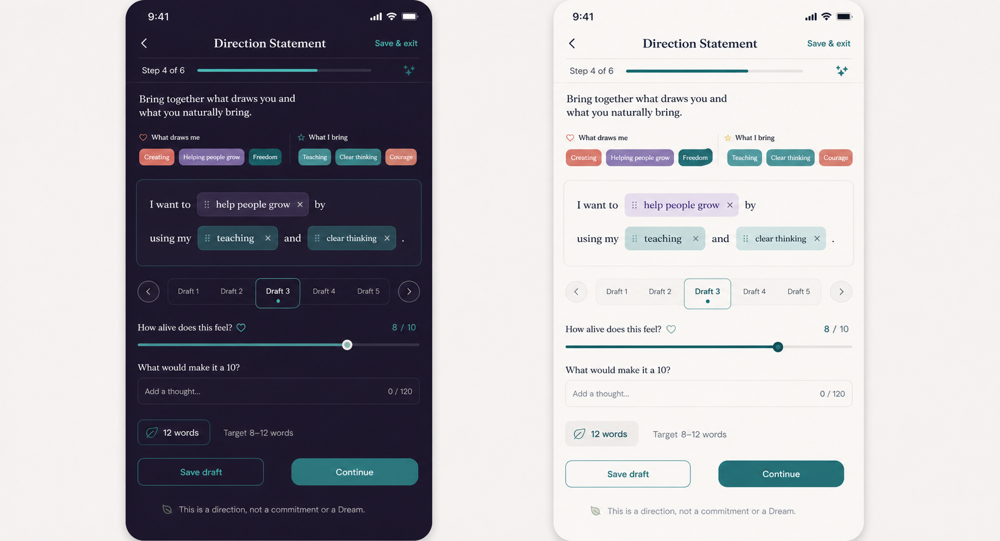

# Direction Statement — Product Requirements Document

Status: **Not planned — founder decision 2026-08-21. Preserved for historical reasoning only; do not implement.**  
Stage: **Not planned**  
Tool type: **Guided synthesis, not a test or commitment**  
Estimated time: **8–12 minutes; resumable**  
Last updated: 2026-08-21

## Purpose and problem

People can name isolated interests and abilities yet still struggle to express a direction that joins them. Purpose generators often solve that discomfort too quickly, producing authoritative language the user did not earn or recognise.

Direction Statement helps a person combine **what draws me** with **what I bring**, compare several editable formulations, and define the words they choose. The result is a working direction—a hypothesis that may support several Dreams—not a destiny, promise, Dream, Journey, or diagnosis.

## Goals

- Turn confirmed reflection inputs into concise, personally meaningful language.
- Preserve uncertainty by encouraging multiple drafts and an “alive” response rather than a correctness score.
- Keep every generated or templated phrase editable and attributable to its source.
- Offer a durable result the user may revisit without silently changing any active product object.

## Non-goals

- Discovering a singular life purpose or declaring what the user “should” do.
- Automatically creating or changing a Dream, Journey, Milestone, Step, or Coach instruction.
- Ranking careers, predicting fit, or assessing personality.
- Requiring Passion Map or Strength Evidence completion; manual input remains possible.
- Optimising for the shortest statement at the expense of meaning.

## User stories

- As a user with several interests, I want to explore combinations without committing to one future.
- As a user with prior Tool results, I want to import only the items I choose.
- As a user who dislikes generated language, I want to write all five drafts myself.
- As a returning user, I want to see the current statement or return to editing and be able to start again.

## Entry and return

### First entry

The Tools card states outcome, time, guided-synthesis status, save/resume, and the prerequisite choice. Entry offers `Use my saved insights` and `Start with my own words`. Import selection previews each Passion Map or Strength Evidence item; nothing is imported silently.

### Return with a draft

Show last-edited time and current step with `Continue`, `Review drafts`, and `Start again`. Reset confirmation clarifies that existing completed results remain unchanged until a new statement is confirmed.

### Return after completion

Open the current statement and word meanings. Actions: `Edit`, `Try another direction`, `Talk to Coach`, `Use this to explore a Dream`, `Delete result`, and `Start again`. Any Dream-related action opens a separate confirmation/conversation flow; the statement itself is never a Dream.

## Detailed flow

1. **Orientation.** Explain that the output is a direction, not a commitment. Show estimated time, privacy, save/resume, and manual/import paths.
2. **What draws me.** Select up to five confirmed Passion Map themes or add short manual phrases. Each imported chip links back to its source and can be removed without editing the source Tool.
3. **What I bring.** Select up to five user-confirmed Strength Evidence labels or add manual phrases under the same rules.
4. **Compose.** Use a flexible sentence canvas, not a mandatory grammatical template. Suggested connectors may help combine chips; users can type freely, reorder, remove, or duplicate ideas across drafts.
5. **Five drafts.** Save up to five variants. One is sufficient to proceed; five encourages exploration but is not a gate. Drafts remain editable and may be compared side by side.
6. **Alive check.** Rate `How alive does this feel?` from 0–10 and optionally answer `What would make it a 10?` This is a private response, not a quality score or success metric. The user selects the preferred draft.
7. **Refine.** Aim for a concise 8–12-word statement, but allow an explicit `Keep it longer` path. Show word count without grading language.
8. **Define.** Ask what each important word means to the user. At least one meaning is required so the statement is not merely polished copy.
9. **Confirm.** Review source chips, preferred statement, word meanings, and optional Coach-share setting. Confirming creates a dated result.
10. **Result.** Show the statement, meaning notes, alternative drafts, date, and clear disclaimer: `A direction, not a commitment or a Dream.`

## Result and downstream use

The durable result contains the preferred statement, personally defined key words, optional alternate drafts, source references, and date. Imported source data is referenced rather than duplicated where possible.

### Draft influence contract

- **Unique knowledge:** the user's own current synthesis of attraction and capability—not a topic list or a chosen Dream.
- **Smallest derived summary proposed:** `{ takenAt, statement, expiresAt }`. Because the statement itself can be sensitive and identifying, even this is available only after explicit share.
- **Permitted reader proposed:** Coach, to ask whether a prospective Dream fits the user's stated direction; never to reject a Dream or steer automatically.
- **Proposed staleness:** 180 days, with user reconfirmation available from the result screen.
- **Possible one-tap handoff:** copy the statement into a visible `Explore a Dream` Coach conversation, only after the user taps and confirms.

This contract is **Open Question / draft**. No reader may consume the result until founder approval and implementation in the audited signals layer.

## UX requirements — light and dark

- Honour the concept's two-tray composition and five-draft navigation while reducing nested containers: one composition surface, one draft control, one primary action.
- Fraunces/Frank Ruhl Libre display roles and Inter controls; identical role line heights across languages.
- Teal signals confirmed selection; secondary coral/purple accents distinguish `draws me` from `I bring` with labels/icons as well as colour.
- Dark surfaces retain visible card edges and strong contrast; light mode uses near-white canvas and quiet white surfaces. Both meet WCAG AA.
- Chips must wrap/reflow for Dynamic Type and RTL, support keyboard and screen-reader reorder controls, and never depend on drag alone.
- 44px targets, reduced motion, focus order, clear error copy, and no horizontal truncation of user-written text.

## Data and privacy

- Store drafts and results locally by default through the Repository abstraction.
- Import only explicitly selected confirmed items; do not copy raw Passion Map or Strength Evidence answers.
- Do not send statement text, drafts, definitions, imported labels, or alive ratings in analytics or logs.
- Sharing with Coach is explicit, reversible, and result-specific pending a broader approved privacy model.
- Support delete/reset/export/account deletion and revoke downstream context when the result is deleted or sharing withdrawn.
- Any model-generated wording requires a separate approved data path; MVP can use local templates/manual composition.

## Edge cases

- No prior results or stale prior results: manual input works fully and stale items are marked before import.
- User has passions but no strengths, or vice versa: allow manual completion of the missing tray.
- Languages produce more than 12 words naturally: permit `Keep it longer`; do not force awkward translation.
- User wants several directions: retain alternatives and mark only one current statement, or leave none current.
- Rating is low: offer revision or save as draft; never nag or block exit.
- Deleted source Tool result: retain the user's confirmed statement but mark the source reference unavailable.
- Mixed RTL/LTR chips and punctuation: preserve semantic order and test composition carefully.
- Storage conflict between devices is out of MVP; do not silently choose one version.

## Success metrics and instrumentation

Success means the user confirms language they recognise and later uses deliberately—not that a high “alive” rating is produced.

- Completion among starts; draft-resume success; proportion that edits suggested/template wording; proportion defining at least one word; result revisit; deliberate Coach/Dream exploration handoff.
- Guardrails: abandon/reset/delete rate, import reversal, long-statement override, and downstream share withdrawal.

Events (no user text): `tool_direction_statement_viewed`, `tool_direction_statement_started`, `direction_source_mode_selected`, `direction_source_item_selected`, `direction_draft_created`, `direction_draft_saved`, `direction_preferred_draft_selected`, `direction_alive_rating_set`, `direction_length_override_used`, `direction_word_meaning_added`, `tool_direction_statement_draft_saved`, `tool_direction_statement_resumed`, `tool_direction_statement_completed`, `tool_direction_statement_result_viewed`, `tool_direction_statement_coach_share_set`, `direction_explore_dream_tapped`, `tool_direction_statement_reset`, `tool_direction_statement_deleted`, `tool_direction_statement_error`.

Allowed properties: step, entry source, manual/import/mixed mode, source-item count bucket, draft count, preferred-draft index, rating bucket, word-count bucket, length override boolean, definitions count, share state, duration bucket, language, theme, and error code.

## Acceptance criteria

- The entry explicitly says this is a direction, not a commitment or Dream.
- Manual-only completion is possible; prior Tool data is never required or silently imported.
- The user can save one to five editable drafts and choose or change a preferred draft.
- The 8–12-word target guides but does not block completion.
- The user defines at least one meaningful word before confirming.
- No Dream/Journey/Step is created or modified without a separate visible user action and confirmation.
- Result, share control, reset, and delete behave offline and revoke derived access correctly.
- Analytics contain no statement, chip, definition, or rating value more precise than an approved bucket.
- Light/dark, English/Hebrew RTL, Dynamic Type, screen reader, keyboard, and reduced-motion QA pass.

## Test scenarios

1. Complete manually with one draft and a statement longer than 12 words.
2. Import selected Passion Map and Strength Evidence items, then remove all imports and finish manually.
3. Create five drafts, navigate among them, edit, select preferred, save/exit, and resume.
4. Enter a low alive rating, exit without revision, and verify no nag or notification is created.
5. Delete an imported source result after completion and verify the Direction Statement remains readable with an unavailable-source marker.
6. Share, withdraw, delete, and inspect Coach context at every transition.
7. Test mixed Hebrew/English chips, punctuation, large text, screen readers, keyboard-only reorder, both themes, and offline mode.
8. Verify analytics/logs never contain user-authored strings or exact alive ratings.

## Competitors and references

- [Ikigai Tool](https://www.ikigaitool.com/ikigai-tool): useful guided synthesis reference; its purpose-style output illustrates the risk of presenting a generated statement as discovery rather than hypothesis.
- Internal research: `05_Research/Coaching_Tools_Digitization_Competitive_Research_2026-08-20.md` §3.5.
- Related input PRD: `04_Product/PRD/Tools_Documentation/Passion_Map_PRD.md`.
- Governing rules: `04_Product/Tool_Addition_Protocol.md`; `04_Product/Design_System.md`.

## Related tasks

- **Dependency:** Passion Map and Strength Evidence must expose only user-confirmed import candidates.
- **Draft / unassigned:** approve influence contract, reader, staleness, and Dream exploration handoff.
- **Draft / unassigned:** write original bilingual prompts, connectors, and non-authoritative suggestion copy.
- **Draft / unassigned:** specify local composition model, source references, deletion behaviour, and signals audit.
- **Draft / unassigned:** implement and QA the analytics events above.

## Product decisions

- **Approved, repository-wide:** Tools never silently create product objects or transmit raw answers.
- **Approved in Passion Map PRD:** Direction Statement remains a separate future synthesis surface; passion is not conflated with ability.
- **Research recommendation, not founder-approved:** Direction Statement follows Passion Map and Strength Evidence while retaining a manual path.

## Future Vision

- Transparent on-device language suggestions that cite selected source chips.
- Dated statement history with user-led comparison and reconfirmation.
- A Coach conversation that explores several possible Dreams against the statement without treating it as a gate.

## Open Questions

- Is the five-draft structure required, encouraged, or reduced for MVP?
- May the statement text itself become Coach context, and under what sharing model?
- Is 180 days the correct staleness period?
- Should 8–12 words remain the target across every shipped language?
- Does `Explore a Dream` belong on the result or only inside a Coach conversation?
