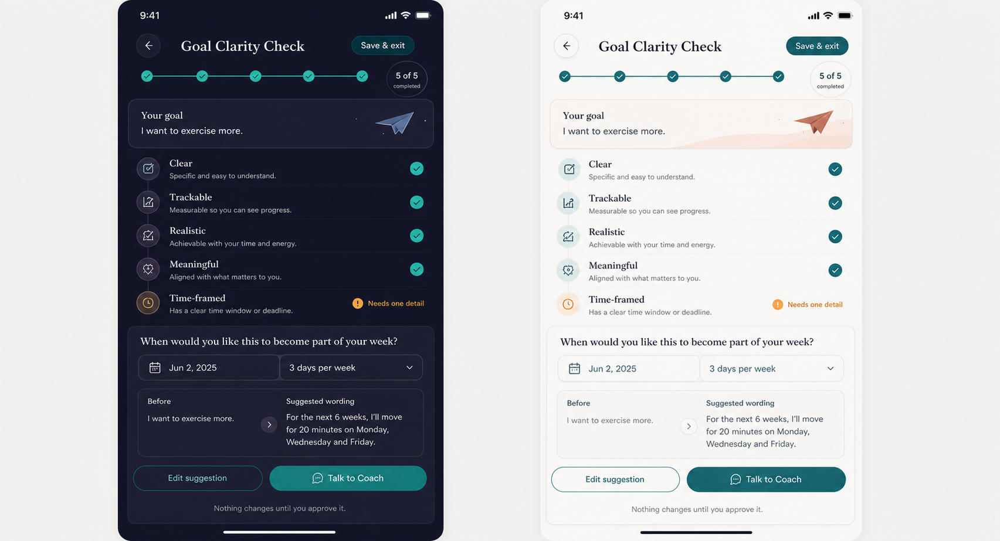

# PRD — Goal Clarity Check

Status: **Not planned — founder decision 2026-08-21. Preserved for historical reasoning only; do not implement.**  
Stage: **Not planned**  
Surface: **Tools → Goal Clarity Check**  
Category: **Find direction**  
Estimated time: **5–8 minutes; resumable**

## 1. Purpose and product problem

Goal Clarity Check helps a person turn a vague aspiration into wording that is clear enough to discuss and
act on, without creating a parallel Journey builder. It conversationally examines five dimensions and shows
a user-controlled before/after draft.

The tool is educational reflection based on the widely used SMART pattern, not an objective assessment. It
serves PushApp only when the clearer wording is taken into the existing Coach/Dream/Journey system by choice.

### Feature-proposal checklist

- **Problem:** vague goals are difficult to discuss, scope, or translate into real action.
- **Why needed:** a short structured check teaches clarity and preserves the person's intent.
- **Improves:** Coach conversation and possible Dream/Journey proposal; it must not duplicate those flows.
- **Complexity:** five-step conversational editing, safe feasibility language, suggestion provenance,
  before/after state, permissions, and avoiding accidental Journey mutation.
- **Philosophy fit:** clarity supports chosen transformation; a five-out-of-five score or automatic plan would
  shift toward performance theatre and is excluded.
- **Stage:** MVP candidate; sequencing remains open.

## 2. Goals and success signals

1. Accept a user-authored aspiration or an explicitly selected existing Dream/Journey context.
2. Help the user consider Clear, Trackable, Realistic, Meaningful, and Time-framed dimensions one at a time.
3. Produce editable suggested wording with a transparent before/after comparison.
4. Hand the confirmed wording to the Coach without silently creating or updating product objects.

Primary signal: users confirm wording they edited or consciously accepted and, if they choose the Coach,
reach an explicit proposal decision. `5 of 5` completion is progress through the reflection, never a score.

### Analytics events to instrument

Never include goal text, answers, suggestions, dates, frequency, Dream/Journey identifiers, or dimension
outcomes in analytics.

| Event | Properties |
|---|---|
| `tool_goal_clarity_opened` | `entry_point`, `input_source: new|dream|journey|draft`, `has_result` |
| `tool_goal_clarity_started` | `locale`, `theme` |
| `tool_goal_clarity_dimension_completed` | `dimension`, `completed_count`, `response_mode: answer|skip` |
| `tool_goal_clarity_saved_exit` | `dimension`, `elapsed_bucket` |
| `tool_goal_clarity_resumed` | `dimension`, `days_since_save_bucket` |
| `tool_goal_clarity_suggestion_generated` | `method: deterministic|ai`, `completed_dimension_count` |
| `tool_goal_clarity_suggestion_edited` | `edit_count_bucket` |
| `tool_goal_clarity_result_confirmed` | `accepted_mode: as_is|edited`, `elapsed_bucket` |
| `tool_goal_clarity_handoff_selected` | `destination: coach` |
| `tool_goal_clarity_handoff_outcome` | `outcome: accepted|declined|abandoned` |
| `tool_goal_clarity_reset_confirmed` | `had_result` |
| `tool_goal_clarity_deleted` | `scope: draft|result|all` |

## 3. Non-goals

- Creating a second Dream/Journey builder or editing an active Journey silently.
- Grading whether a goal is good, worthy, ambitious, or achievable.
- Requiring every aspiration to have a deadline or numeric measure.
- Giving professional feasibility advice or inferring capacity from sensitive data.
- Creating Steps, schedules, reminders, or notifications.
- Replacing the Coach's confirmation/proposal flow.

## 4. Entry and return behavior

Entry may come from the Tools tile with new text, or from a Dream/Journey action that clearly identifies the
source and copies wording into a separate draft. Source objects remain unchanged. First use explains
`5 questions · about 5–8 minutes`, that skipping is allowed, and `Nothing changes until you approve it`.

An unfinished check resumes at the last dimension. A confirmed result opens the before/after summary with
**Edit suggestion**, **Talk to Coach**, **Run another check**, and **Delete**. Editing creates a draft; the
confirmed result remains current until saved. Starting over requires confirmation.

## 5. Detailed flow

### 5.1 Capture intent

Ask `What would you like to make clearer?` Accept concise text or a copied source statement. Preserve the
original verbatim for comparison. The user confirms this is the idea they want to examine.

### 5.2 Five conversational dimensions

Each screen explains one dimension in plain language, asks one question, offers examples as editable prompts,
and permits **Skip for now**:

1. **Clear** — What exactly would be different?
2. **Trackable** — What would let you notice progress or completion? Qualitative evidence is valid.
3. **Realistic** — What time, energy, support, or constraint should the wording respect? The user judges
   feasibility; PushApp does not certify it.
4. **Meaningful** — Why does this matter to who you choose to become? This is relevance, not moral worth.
5. **Time-framed** — Is a date, period, cadence, or review point useful? `No fixed date` is valid.

Progress shows completed operations (`3 of 5 reviewed`), not pass/fail checks. The user can revisit any
dimension. Answers autosave locally.

### 5.3 Compose a suggestion

Build a suggested statement only from user-provided details. A deterministic template may ship first. If AI
is later used, mark it **Suggested**, explain which answers informed it, never introduce unsupported facts,
and keep generation optional. Missing dimensions remain visible as `Not specified`, not guessed.

### 5.4 Before/after review

Show original and suggested wording side by side or stacked, plus the five dimension summaries. The user can
edit freely, revert, or return to a question. The concept's `Needs one detail` language is acceptable only as
a neutral invitation—not warning/deficiency—and must permit `Not needed for this goal`.

### 5.5 Confirm and hand off

Confirmation saves a private result; it does not mutate its source. **Talk to Coach** opens the single Coach
conversation with the original and confirmed wording only after explicit action. The Coach may discuss a
Dream or propose creating/updating a Journey through existing confirmation flows. The user can decline and
keep the result.

## 6. Result and downstream use

The result includes original wording, confirmed wording, five user-authored dimension notes, skipped/not-
needed states, date, and provenance (`user edited`, deterministic suggestion, or future AI suggestion).

The influence contract is **Open and required before release**. Safest draft recommendation: the tool teaches
the app nothing passively and exposes no persistent derived signal. On **Talk to Coach**, pass the confirmed
result as one-time, user-authorized conversation context; it expires when that handoff conversation ends.
This recommendation is not approved. No other reader—including Home, Buddy, notifications, Allies, Support
Circle, or unrelated Coach conversations—may access it unless the founder approves a specific contract.

## 7. UX specification — light and dark

The supplied image is a **design concept**, particularly useful for the final review. Keep the five-stage
progress line, original-goal surface, readable dimension list, focused missing-detail editor, before/after
comparison, and two clear actions. Do not turn five checks into a score badge; replace `5 of 5 completed`
with `5 of 5 reviewed` in implementation copy.

Display titles use Fraunces/Frank Ruhl Libre by language; body uses Inter. One subject, one surface, with
hairline-separated dimension rows. Teal indicates reviewed/current growth context; amber appears only for a
user-actionable missing detail and is paired with words/icon—not urgency.

- **Light:** near-white page, white edged surfaces, dark ink, teal primary Coach CTA, restrained coral
  illustration accent.
- **Dark:** deep neutral/navy page, distinct surfaces/edges, high-contrast type, teal CTA, and muted amber.
- RTL reverses reading/navigation and comparison direction while preserving `Before` and `Suggested wording`
  semantics. Dynamic Type stacks comparisons and buttons. Reduced Motion removes progress-line drawing and
  paper-plane movement. All targets are at least 44px.

## 8. Data, privacy, and safety

Goal text, answers, suggestions, and source links are on-device by default and excluded from analytics. Export
and deletion cover drafts, confirmed results, provenance, and any source reference. A copied Dream/Journey
reference grants no permission to mutate it. One-time Coach handoff requires an explicit action and clear
preview of what is shared; server/AI processing, if introduced, requires the approved privacy/security model
and must not be silently enabled.

Copy avoids shame and does not claim clinical, legal, medical, financial, or career authority. Realistic is a
self-reflection on constraints, not a promise by PushApp.

## 9. Edge cases

- Blank/whitespace input: do not start; preserve draft state.
- Very long input: provide a generous documented limit and accessible counter; exact limit is Open.
- No measurable outcome: accept qualitative evidence or `I will know by...`.
- No appropriate deadline: accept a review point or no time frame.
- Goal concerns grief, health, safety, money, or another sensitive area: do not certify feasibility; preserve
  neutral language and existing safety routing.
- Suggestion invents detail: user can see provenance, remove it, and report it; deterministic path must not.
- Source Dream/Journey changes or is deleted mid-draft: preserve copied text, mark source unavailable, never
  write back automatically.
- Offline/no Coach session: result remains usable; Coach action states unavailability and offers retry.
- Partial completion: generate only if the user chooses; mark unspecified dimensions honestly.

## 10. Acceptance criteria

1. The user can enter/copy wording, review five dimensions, skip or mark a dimension unnecessary, and resume
   exact progress.
2. The result preserves original and confirmed wording and identifies suggestion provenance.
3. No UI presents a pass/fail score; progress is labelled reviewed, not achieved.
4. No Dream/Journey/Step/reminder changes until the existing separate confirmation flow succeeds.
5. Coach handoff is explicit, previewed, and unavailable honestly when no session exists.
6. Raw content is absent from analytics and from unauthorized readers; export/delete are complete.
7. Light/dark, English/Hebrew RTL, large type, screen reader, keyboard/switch, and reduced motion pass QA.
8. Shipping is blocked until the influence contract and any AI/privacy processing are explicitly approved.

## 11. Test scenarios

- Complete all five dimensions; edit suggestion; compare and confirm.
- Skip Trackable and mark Time-framed unnecessary; verify no invented detail or failing score.
- Enter from an active Journey, confirm result, decline Coach proposal, and verify Journey is byte-for-byte
  unchanged.
- Delete/change the source while draft is open and finish safely.
- Save/exit at each dimension and resume after relaunch/offline.
- Open Coach handoff without a session; verify honest failure/retry and intact result.
- Exercise deterministic suggestion with adversarial/sensitive text and verify it uses only supplied details.
- Inspect analytics, export, single-result deletion, and delete-all for content leaks.
- Verify Hebrew RTL, both themes, largest text, reduced motion, and screen-reader traversal.

## 12. Competitors and references

- [Goals: AI Coach](https://apps.apple.com/us/app/goals-ai-coach-habit-tracker/id1474850893) — integrates
  SMART goal creation with steps, reminders, and progress; the integration pattern is useful, while PushApp
  must avoid becoming a parallel habit tracker or auto-plan generator.
- [Goal-writing randomized trial](https://pubmed.ncbi.nlm.nih.gov/20367810/) — supports education plus
  follow-up rather than a one-off worksheet.
- Internal research: `../../../../05_Research/Coaching_Tools_Digitization_Competitive_Research_2026-08-20.md`
  §3.8.

The best transferable pattern is a five-part conversational check followed by before/after wording. PushApp's
improvement is strict separation from Journey mutation plus a user-authorized Coach handoff.

## 13. Related tasks and dependencies

- Decide and implement the Goal Clarity influence contract before release.
- Confirm original English/Hebrew dimension copy and whether `SMART` appears only as research lineage.
- Reuse Coach availability/retry and existing Dream/Journey proposal confirmation.
- Implement local model/store/signals, export/deletion, accessibility, analytics, and QA.
- Security/privacy review before any AI/server processing of goal text.

## 14. Decision register

### Product Decisions (Approved)

- Every tool must provide user value and declare an influence contract; raw answers stay on device by default.
- A tool never creates or changes a Dream, Journey, Step, reminder, or notification automatically.
- Official Dream/Journey terminology and existing Coach proposal/confirmation flows remain authoritative.
- Founder-supplied/branded wording is not copied merely because it was supplied.

### Future Vision

- Optional AI rewriting with visible provenance, explanation, editing, and the approved privacy model.
- Re-checking a confirmed statement later, with neutral dated comparison.

### Open Questions

- Approve or revise the one-time Coach handoff influence recommendation in §6.
- Which MVP candidate ships first, and is Goal Clarity Check in that sequence?
- What are the input/answer length limits and retention period?
- Should entry be offered from both Dreams and Journeys, or Tools/Coach only?
- Does user-facing copy mention SMART, or use only PushApp's original five labels?
