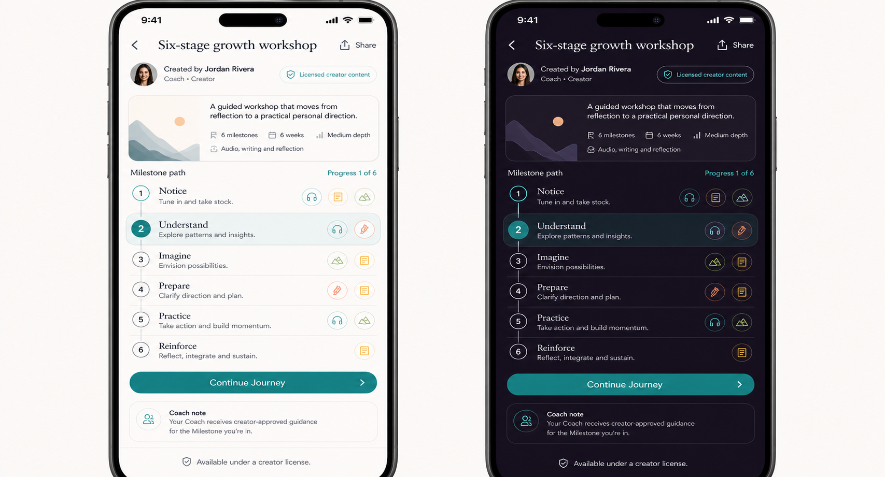

# PRD — Licensed Creator Workshop Journey

Status: **Not planned — founder decision 2026-08-21. Preserved for historical and rights reasoning only; do
not implement the supplied six-stage method.**
Stage: **Not planned**.
Type: **Creator-authored Journey**, not a standalone questionnaire Tool.
Related historical platform direction: `../../Future/Creator_Journey_Authoring_Platform_PRD.md`.
Research: `../../../../05_Research/Coaching_Tools_Digitization_Competitive_Research_2026-08-20.md` §3.9.

---

## Design reference

The image shows how rich workshop content might appear. It does not authorize the supplied Winner's Code
method, wording, sequence, branding, or artwork.

## 1. Purpose and classification

Preserve the future capability to deliver a licensed coaching workshop through PushApp's Journey engine. A
multi-stage method with media, exercises, dependencies, repeated practice, Coach guidance, and completion
rules is a Journey, not a quick Tool. It may be discovered from Tools or a future marketplace, but its runtime
and lifecycle belong to Journey infrastructure.

## 2. Rights gate

Before any branded workshop is digitized, PushApp must hold written rights covering at least:

- method and sequence;
- names, wording, questions, exercises, examples, artwork, audio, and video;
- translation and localization;
- digital adaptation and interactive derivatives;
- AI/Coach use of the creator's instructions and content;
- analytics, updates, distribution territories, term, withdrawal, and existing-user access.

Possessing a PDF or image is not evidence of these rights. Without them, build only original PushApp content.

## 3. Intended product impact

A licensed workshop may add:

- a structured Journey matched to an appropriate Dream;
- creator-authored Milestones, Steps, media, inputs, dependencies, repetition, and success rules;
- per-Step instructions for how the coach should support the user in real time;
- user-owned reflections and progress;
- privacy-safe aggregate outcome evidence for the creator under the separate platform policy.

It may never overwrite an active Journey, expose personal responses to a creator by default, or claim clinical
effectiveness without evidence and authorized wording.

## 4. Required authoring model

The future platform must support:

- workshop title, description, suitable Dream contexts, creator identity, language, version, and license;
- one or more Milestones and their order/eligibility;
- Steps with text, image, audio, video, open/closed questions, uploads, and completion requirements;
- dependencies, recurring Steps, optional/required Steps, cyclic Milestones, and threshold-based Journey
  completion;
- duration, expected effort, accessibility alternatives, and content warnings;
- per-Step coach instructions and boundaries;
- preview, validation, versioning, draft/review/publish/retire states;
- migration policy for users already inside an older version.

## 5. User flow

1. Discover or receive a Coach suggestion for the workshop.
2. Review creator, purpose, duration, content types, permissions, accessibility, price if any, and data use.
3. Explicitly adopt it as a proposed Journey linked to one or more approved Dreams.
4. Follow the normal Journey lifecycle across Milestones and Steps.
5. Use the coach from Journey/Step context; the coach receives only licensed instructions and authorized user
   context relevant to the current Step.
6. Complete, freeze, postpone, or abandon under existing Journey rules.
7. Review the outcome and provide optional feedback separately from completion.

## 6. UX direction

- Tools may show a quiet discovery tile, but opening it clearly transitions into a Journey detail/adoption flow.
- Rich editorial cover, creator attribution, Milestone path, and sample content should feel premium without
  obscuring duration, permissions, or difficulty.
- Runtime screens follow the main Journey design system; they do not create a second progress model.
- Light/dark media treatments, captions/transcripts, audio controls, RTL, screen readers, Dynamic Type, and
  reduced-motion alternatives are mandatory.

## 7. Privacy, safety, and creator boundaries

- Creator receives aggregate privacy-safe analytics unless the user separately consents to identifiable data.
- User free text, audio, images, completion reports, Coach conversations, Dreams, and Support Circle data are
  not creator-visible by default.
- Upload Steps define media retention, permissions, report/block, export, and deletion.
- Coach instructions are content, not authority to bypass safety policy or manipulate the user.
- Health, finance, therapy, addiction, or other regulated/sensitive workshops require the relevant compliance
  and evidence review.
- Retiring a license must define existing-user continuity and access to user-authored work.

## 8. Edge cases

- License expires while users are active: preserve lawful access or provide an explicit migration/closure path.
- Creator publishes a breaking version: active users remain on their pinned version unless they approve a safe
  migration.
- Media unavailable/offline: cache only according to rights; offer transcript/alternative and never lose input.
- Required upload permission denied: provide an approved alternative or explain that the Step cannot complete.
- Cyclic Milestone never advances: user/coach can review readiness without hidden automatic promotion.
- Creator account removed: preserve provenance and user-owned data under contract.
- Workshop conflicts with an active Journey: Coach may propose scheduling/future placement, never auto-replace.
- Refund/payment dispute: handled by the future commerce PRD, not Journey completion logic.

## 9. Acceptance criteria

1. A valid rights record is required before branded content enters authoring or runtime.
2. The concept uses canonical Dream/Journey/Milestone/Step objects and lifecycle rules.
3. Users preview scope, creator, permissions, data use, and accessibility before adoption.
4. Per-Step coach instructions cannot override safety, privacy, or user approval.
5. Creator analytics exclude identifiable user content by default.
6. Content versions are immutable for active users unless a migration is explicitly approved.
7. License expiry, retirement, offline media, denied permissions, deletion/export, RTL, and accessibility are
   tested.

## 10. Related work and blocking questions

Dependencies: Creator Journey Authoring Platform, Journey library/matching, Coach tool architecture, media
storage, content moderation, store compliance, contracts/licensing, creator analytics, and future commerce.

Blocking decisions:

1. Does PushApp own or license the supplied Winner's Code method? No assumption is allowed.
2. Which creator review, publishing, and takedown process applies?
3. What data can creators see and what outcome claims may they make?
4. What happens to purchased/adopted content after license termination?

This file preserves the platform capability; it does not approve any specific workshop.
