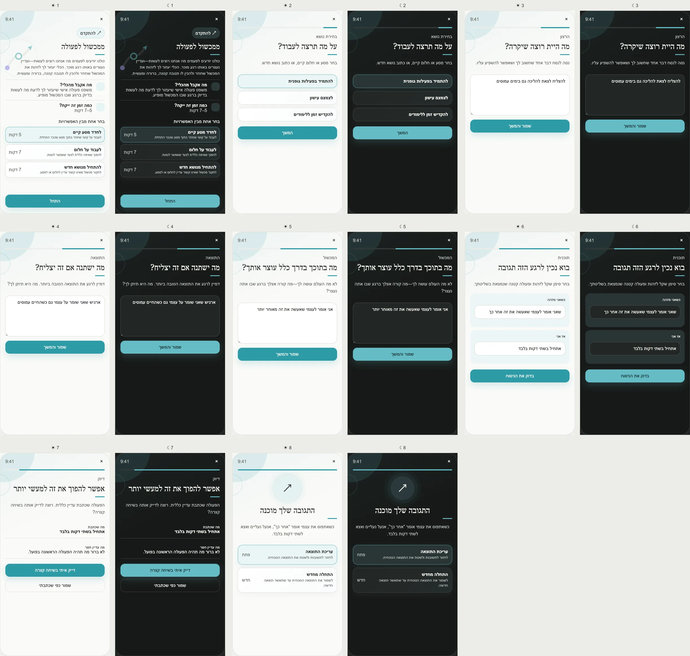

# PRD — Obstacle to Action

Status: **Founder-approved product and UX specification; ready for implementation planning.**
Stage: **POC** for the guided core and local quality check; Coach-assisted refinement uses the existing Coach
infrastructure and must pass the privacy gate in §13 before release.
Type: **Action-planning Tool**, not a goal-setting assessment.
Surface: **Tools → Move Forward → Obstacle to Action**.
Related: Dreams, Journeys, Coach Conversation, Tool Addition Protocol, Weekly Review, localization.
References: [WOOP](https://woopmylife.org/en/home),
[implementation intentions](https://cancercontrol.cancer.gov/brp/research/constructs/implementation-intentions),
and the [MCII meta-analysis](https://pmc.ncbi.nlm.nih.gov/articles/PMC8149892/).

---

## Design reference

The image contains every approved screen in §7. It is product direction, not implementation evidence. Written
privacy, approval, validation, and canonical-object rules in this PRD are authoritative.

## 1. Purpose

Help a user turn one recurring internal obstacle into a specific response they can recognize and perform when
that obstacle appears.

The Tool does not create a Dream, Journey, Milestone, Step, reminder, or claim that a plan will guarantee
success. It gives the user one editable **if–then response** grounded in their own words.

## 2. Product problem

Users often know what they want but fail at a predictable moment: “later,” “I am too tired,” “this is too
large,” or “one miss means the day is lost.” A generic intention does not tell them what to do in that moment.
Existing WOOP implementations preserve a valuable four-part structure but commonly stop at collecting text.
PushApp improves the digital experience by checking whether the trigger is recognizable and the response is
specific, controllable, and small enough to begin.

## 3. User outcome

The user leaves with one confirmed statement:

> When I notice **[recognizable situation or internal response]**, I will **[small action under my control]**.

Estimated duration:

- existing Journey: approximately **5 minutes**;
- Dream or new topic: approximately **7 minutes**.

## 4. Entry and start options

The opening screen contains the Tool name, inviting explanation, target-shaped outcome icon, clock icon,
estimated time, and a visible **Start** button without scrolling.

Before Start, show **Choose one of the options** and three selectable routes, each with its own explanation and
time:

1. **Refine an existing Journey** — choose a recurring difficulty inside a Journey; about 5 minutes.
2. **Work from a Dream** — explore an obstacle related to a long-term aspiration; about 7 minutes.
3. **Start from a new topic** — explore something not yet connected to a Dream or Journey; about 7 minutes.

Choosing a Dream or Journey creates context only. The Tool never edits the linked object.

## 5. Core method

The experience uses four semantic stages inspired by WOOP but with original PushApp wording and interaction:

1. **Wish:** one influenceable outcome the user wants.
2. **Outcome:** what would become meaningfully better.
3. **Obstacle:** the internal response that usually interrupts action.
4. **Response:** a recognizable trigger and one small action.

Generated language is always a proposal. The user owns the final wording.

## 6. Quality check and Coach refinement

The first check is deterministic and local. It asks:

- is the trigger something the user can recognize when it happens?
- is the response under the user's control?
- is there one concrete first action?
- is the response small enough to start in the stated moment?
- is it free of impossible guarantees or third-party control?

If the answer appears vague, show what is missing and offer:

1. **Refine with me in a short conversation**;
2. **Save what I wrote**.

The conversation opens only after explicit selection. It receives the minimum context required: the chosen
Dream/Journey identifier, the current trigger, the current response, and the failed quality dimensions. It may
ask a few questions and propose a visible before/after edit. The original remains current until the user
approves the complete replacement.

## 7. Approved screen inventory

1. **Opening:** value, duration, three routes, Start visible without scrolling.
2. **Topic selection:** select the linked Journey, Dream, or new topic.
3. **Wish:** “What would you like to happen?”
4. **Outcome:** “What would change if this worked?”
5. **Obstacle:** “What inside you usually stops you?”
6. **Response builder:** separate **When I notice…** and **Then I will…** fields.
7. **Refinement offer:** explain the missing quality; Coach conversation is optional.
8. **Confirmed result:** show the final if–then response, Edit, and Start over.

Every answer screen has one cognitive operation, autosave, Back, exit/resume, and visible progress.

## 8. Returning behavior

Return opens the current confirmed response, not a blank form. Actions:

- Edit current result;
- Start over;
- optionally open the linked Dream/Journey;
- delete the Tool result.

Editing and restarting use drafts. The confirmed result remains safe until a new version is approved.

## 9. Influence contract

### What becomes knowable

One user-confirmed trigger/response pair and optional link to one Dream or Journey.

### Smallest derived summary

`{ resultId, confirmedAt, contextType, contextId?, triggerCategory?, hasConcreteResponse }`

Raw wording is not part of general analytics or an unrestricted user profile.

### Permitted consumers

- Tool result screen: full confirmed wording;
- Coach refinement: only after the user requests it;
- linked Dream/Journey conversation: only after a separate **Discuss this with the Coach** action.

### Prohibited automatic effects

Never create or modify a Dream, Journey, Milestone, Step, reminder, weekly plan, notification, or identity
label. Never treat a plan as proof the user performed it.

### Freshness

Mark the result contextual after **90 days** or when the linked Journey completes, is abandoned, or materially
changes. Keep it visible; stop offering it as current context until reconfirmed.

## 10. Data model

Suggested entity `ObstacleActionResult`:

- `id`, `ownerId`, `createdAt`, `updatedAt`, `confirmedAt`;
- `contextType: dream | journey | standalone` and optional `contextId`;
- encrypted/private `wish`, `outcome`, `obstacle`, `trigger`, `response`;
- `qualityFlags[]`, `refinementSource: none | local | coach`;
- `status: draft | confirmed | superseded`;
- `schemaVersion`, `locale`.

## 11. Validation and edge cases

- Blank or whitespace-only text cannot advance; Skip is allowed for Outcome but not for final trigger/response.
- Long text remains editable; apply clear limits based on user-perceived characters, not UTF-16 units.
- A trigger controlled only by another person receives a clarification prompt.
- A response containing several actions asks the user to choose the first one.
- If the local check is unavailable, manual completion remains available.
- If the Coach is unavailable, preserve the draft and allow manual save; never block completion.
- If the linked object was deleted, keep a standalone result and remove the broken link.
- Offline use supports the complete manual flow; Coach refinement waits for connection.
- Concurrent edit conflicts preserve the confirmed version and offer recovery of both drafts.

## 12. UX and visual rules

- Color family: **teal / forward movement**. It is wayfinding, not success status.
- The opening illustration stays decorative in the background so Start is visible without scrolling.
- Light and dark modes use equivalent hierarchy and contrast; dark mode is not a color inversion.
- The final response receives stronger visual emphasis than the collected prose.
- No countdown, score, streak, XP, or shame copy.

## 13. Privacy, safety, and analytics

The manual Tool works without sending raw text to a model. Coach refinement is a user-requested disclosure and
must explain that the shown text will be used for that conversation. This is a scoped exception requiring the
same AI privacy controls as Coach Conversation; it is not permission for background analysis.

Analytics may record structural events, route, completion, quality-flag categories, and Coach-refinement opt-in.
Never log raw answers, context titles, or generated wording.

Account deletion removes all Tool data. Scoped deletion removes the Tool result without touching the linked
Dream or Journey.

## 14. Acceptance criteria

- Every route fits its opening content and visible Start action without scrolling on the minimum supported
  viewport and largest supported accessibility text size through an approved responsive fallback.
- The complete manual flow works offline.
- No proposed refinement is saved without full confirmation.
- A failed or cancelled Coach call cannot damage the last confirmed result.
- Screen order, light/dark behavior, RTL layout, Back, resume, Edit, Start over, and deletion are tested.

