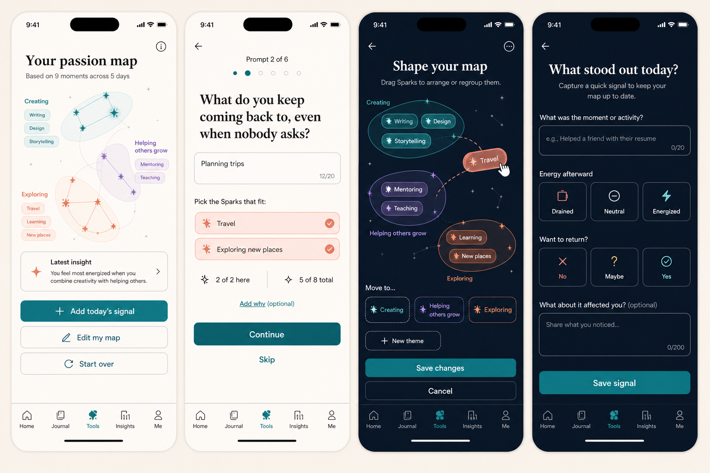

# PRD — Passion Map

Status: **Product and UX specification draft — product decisions recorded; awaiting explicit founder approval
for implementation.**
Stage: **Commercial candidate** for Initial Discovery; **Future subfeature** for Live Discovery. Neither is an
MVP dependency. Live Discovery has a separate release gate because it adds daily collection, reminders,
retention, synthesis, and deletion complexity even though it refines the same Passion Map.
Owner: founder + AI product team.
Surface: **Tools → Passion Map**.
Related: Tools, Coach Conversation, Dreams, Strength Evidence, privacy/export/deletion,
localization, and future User Learning.
Research: `../../../05_Research/Coaching_Tools_Digitization_Competitive_Research_2026-08-20.md` §3.3.

---

## Design reference

This image is the current UX direction, not implementation evidence. The written rules in this PRD remain
authoritative where generated mockup copy or navigation differs from the live Information Architecture.

---

## 1. Purpose

Help a user notice what currently gives them energy, curiosity, absorption, and a desire to return — then test
those initial impressions against moments from real life.

The Passion Map is a **guided reflection game**, not a personality test, career test, diagnosis, or mechanism
that claims to reveal one permanent purpose. Its output is a small, editable collection of current passion
themes supported by the user's own examples.

The feature has two inseparable parts:

1. **Initial discovery:** a short game that collects and organizes the user's first clues;
2. **Live discovery:** an optional daily check-in that gathers real-world evidence and proposes refinements.

The tool succeeds when it gives the user useful language for what draws them and produces confirmed context
that may later help them explore a Dream or talk with the Coach. Completion time, repeat usage, or time in the
app are not the objective.

## 2. Product problem

People often answer “What are you passionate about?” with socially expected identities, activities they are
already good at, or careers they believe are practical. A long open list creates fatigue; a rigid quiz creates
false authority; and a one-time result ignores the difference between what sounds appealing and what actually
energizes the person.

PushApp needs a flow that:

- makes the first reflection light, bounded, and inviting;
- forces thoughtful prioritization without implying a correct answer;
- asks what lies underneath an activity, not only what the activity is;
- keeps passion separate from skill, income, profession, and moral worth;
- lets lived experience confirm, complicate, or challenge the first map;
- treats changing interests as learning, never inconsistency or failure.

## 3. Product principles

### 3.1 Clues, not labels

User-facing language uses **clue**, **pattern**, **Spark**, **theme**, and “what seems to draw you right now.” It
must not say “your true passion,” “your calling,” “your type,” or “we discovered your purpose.”

### 3.2 Game feel without gamification pressure

The game feeling comes from collecting Sparks, arranging them, and revealing Constellations. The feature has
no XP, Coins, score, leaderboard, Streak, countdown, right answer, failure state, or reward for opening it.

### 3.3 A deliberately small map

Limits are a feature. They create a map that can guide reflection rather than a catalog of everything the user
likes.

### 3.4 Reality can correct the first answer

Daily evidence may strengthen, weaken, split, combine, or contextualize a theme. The system never silently
renames, deletes, or rewrites the confirmed map. It proposes a visible change and the user accepts, edits, or
dismisses it.

### 3.5 Privacy and agency

Answers and daily moments are private by default. Saving a map does not automatically create a Dream, change a
Journey, or expose the result to friends or Allies. Any use by the Coach or conversion into a Dream requires a
separate explicit confirmation until the shared Tools privacy policy decides otherwise.

## 4. Entry points and return behavior

### 4.1 First use

- Tools → Passion Map tile.
- The tile shows **5–7 min** and labels the experience **Reflection**, not Assessment.
- Opening an unfinished run resumes at the last autosaved screen.

### 4.2 Returning user

Once a map exists, every entry opens the **current confirmed summary** rather than restarting the initial game
or dropping the user directly into a form. The summary shows the current Constellations, their supporting
Sparks, the current evidence statement, and the latest accepted insight.

The user always has three clear actions:

1. **Add today's signal** — enter Live Discovery;
2. **Edit my map** — return to the existing Sparks, Why notes, and Constellation arrangement without creating a
   new run;
3. **Start over** — begin a fresh six-prompt exploration after confirmation.

Start over creates a new dated draft. The current map remains active until the new run is explicitly confirmed,
so abandoning a restart can never erase or replace a usable result. Once the new map is confirmed it becomes
the current map; PushApp does not retain the complete superseded raw map indefinitely merely because the user
restarted. The accepted change log may retain the minimal before/after theme diff needed for **How your map is
changing**, and that history remains visible and deletable by the user.

Editing also uses a draft: changes become current only after **Save changes**. Exiting or discarding an edit
restores the last confirmed summary.

### 4.3 Coach and Dream entry points

After the user confirms a map, PushApp may offer:

- **Explore this with the Coach** — opens the one Coach conversation with typed context stating that the user
  chose to discuss the confirmed Passion Map;
- **Use this to explore a Dream** — starts a Coach-led Dream conversation. A theme is context, not itself a
  Dream, and no Dream is created without the existing Coach proposal and user approval flow.

Neither action is required to finish the tool.

## 5. Experience model and terminology

- **Spark:** one concise activity, moment, subject, contribution, or kind of experience that attracts the user.
- **Why note:** the user's optional explanation of what about a Spark draws them.
- **Constellation:** an editable theme grouping one or more related Sparks. This is presentation language; the
  persisted domain concept is a passion theme.
- **Daily signal:** one dated lived moment recorded during Live Discovery.
- **Refinement proposal:** a suggested diff to the current map derived from evidence, never an applied change.

These terms are local to this tool and do not replace canonical Dream, Journey, Milestone, or Step terminology.

## 6. Initial discovery flow

Target: **5–7 minutes**. One cognitive operation per screen. Every screen autosaves and offers exit/resume.

### 6.1 Introduction

Purpose copy:

> Let's notice what brings you alive.
>
> You'll answer six short prompts and collect up to eight Sparks — moments, activities, and subjects that draw
> you in. There are no right answers, and this is only a starting map. You can test it against real life later.

Show:

- `6 prompts · about 5–7 minutes`;
- the global limit: `Up to 8 Sparks`;
- “You can skip any prompt”;
- “Your map stays editable.”

Actions: **Start exploring** and **Not now**.

### 6.2 Six prompt rounds

Each prompt occupies one screen. The user may add **zero, one, or two Sparks** per prompt, subject to the
global maximum of eight. A compact counter shows both limits: `1 of 2 here · 5 of 8 total`.

Each prompt may show three or four lightweight inspiration chips. They are examples, not a fixed answer bank.
Tapping one places editable starter text in an answer field; it does not become a saved Spark until the user
confirms it. **Write my own** is equally prominent.

Approved semantic prompts:

1. **Energy** — “What can you do for a long time and still feel more energized afterward?”
2. **Natural return** — “What do you keep coming back to, even when nobody asks or rewards you?”
3. **Absorption** — “When did you recently lose track of time — in a good way?”
4. **Enjoyable contribution** — “What do people ask you for help with that you genuinely enjoy helping with?”
5. **Freedom from judgment** — “If you knew nobody would judge you, what would you try, learn, make, or
   explore?”
6. **Meaningful change** — “What change — in your life or someone else's — would feel deeply worth
   contributing to?”

Prompt examples must be diverse across creating, learning, movement, nature, care, exploration, building,
organizing, performance, analysis, community, and quiet solitary activity. They must not imply that passion
must become a career or benefit other people.

Rules:

- Spark label length: **1–20 characters**. The limit is intentionally short so each Spark remains a scannable
  activity/idea label rather than becoming a journal entry;
- count user-perceived characters (Unicode grapheme clusters), not UTF-16 code units, so emoji, combining marks,
  and Hebrew niqqud are not over-counted;
- show an always-visible `X/20` counter once the user begins typing;
- trim whitespace; whitespace-only input is not saved;
- identical normalized text triggers a merge suggestion but may remain separate if the user says the context
  differs;
- at eight Sparks, **Add** becomes **Replace a Spark** and opens the review tray; nothing is silently removed;
- Back permits editing prior prompts without losing later answers;
- Skip is always available and carries no warning.

### 6.3 Review and narrowing

Show all collected Sparks in one editable tray. The user can edit, delete, or merge duplicates and chooses the
**three to five that feel strongest today**.

- Eight is the collection cap for the first run, not the final-theme count.
- Four Sparks are recommended for useful clustering, but there is no hard completion minimum.
- With fewer than four, the result is explicitly an **early clues** view; PushApp does not invent missing
  themes or block completion.

### 6.4 Optional Why pass

For each selected Spark, ask:

> What is it about this that draws you in?

The answer is optional. The user can skip one Spark, skip all, or return later. The interface must say
**Optional** beside the input rather than hiding the choice in secondary copy.

- maximum **300 characters** per Why note;
- the 20-character Spark limit does not apply to the separate Why note: the label stays short while the user
  retains space to explain its personal meaning;
- text input in the first release; voice may be added later through the shared voice-input capability;
- Why notes may help clustering and Coach discussion but never override the Spark's user-authored meaning.

### 6.5 Constellation arrangement

PushApp proposes **one to four** Constellations from the chosen Sparks, based on available evidence. It never
creates extra groups to satisfy a visual minimum. A deterministic local grouping may ship
before AI synthesis; AI is not required for completing or editing the map.

The user can:

- drag a Spark between Constellations;
- use an accessible **Move to…** menu instead of drag;
- rename a Constellation;
- create a new Constellation;
- merge or split Constellations;
- leave a Spark ungrouped;
- undo the latest arrangement.

Every generated title is marked **Suggested** until confirmed. Grouping must remain explainable from the
included Sparks and Why notes; it must not infer sensitive traits, diagnoses, or life history.

### 6.6 Reveal and confirmation

The result presents the user's Passion Map with:

- one to four active Constellations where evidence supports them;
- the Sparks and optional Why notes inside each;
- the date and evidence statement, initially `Based on your first exploration`;
- copy: **These are clues, not labels. Your map can change as you learn from real life.**

Actions:

1. **Save my map**;
2. **Keep editing**;
3. after save, **Make the map live**;
4. after save, optional Coach/Dream actions from §4.3.

No generated theme becomes part of the saved map before the user presses **Save my map**.

## 7. Live Discovery — daily evidence tracking

### 7.1 Positioning

Live Discovery starts as an optional **seven-day experiment**. After seven days the user may continue without
an end date. It has no streak, required frequency, completion percentage, red missed days, or penalty. A blank
day means only that no signal was recorded.

The user may enable or decline a daily reminder through the standard reminder and active-hours rules. Declining
notifications does not reduce functionality.

### 7.2 Daily entry

Target: **45–90 seconds**. The user records **one to three** moments or activities from that day. A moment may
be linked to an existing Spark/Constellation or saved as **Not sure yet**.

For each moment:

1. **What happened?** — a concise **1–20 character** activity/moment label, with recent Sparks available as
   shortcuts and an always-visible character counter;
2. **Energy afterward** — Drained / Neutral / Energized;
3. **Pull to return** — Would avoid / Maybe / Want again;
4. **What about it affected you?** — optional text, up to 300 characters, directly accessible on the same
   screen as the 20-character moment label rather than hidden behind a secondary menu;
5. optional context chips such as Alone / With people, Creating / Learning / Helping, Calm / Intense.

Energy and Pull are separate. An exhausting activity may still feel worth returning to; an easy activity may
not be meaningful. The system must preserve that distinction rather than collapse it into one passion score.

### 7.3 Refinement logic

Daily signals update evidence behind the map, not the confirmed map itself.

The first implementation uses transparent, conservative rules:

- one signal can appear in the activity history but cannot trigger a theme change;
- a proposal requires a repeat pattern across **at least three signals on at least two different days**;
- contradictory contexts remain visible instead of being averaged away, for example: “Creating alone has
  energized you; creating under a deadline has drained you”;
- repeated Energized + Want again signals may propose adding or strengthening a Spark/theme;
- repeated Drained + Would avoid signals may propose adding context, weakening confidence, moving a Spark, or
  asking whether it still belongs — never deleting it automatically;
- absence of signals is not negative evidence.

Thresholds are configuration, versioned with the synthesis logic, and must be tuned through qualitative
research rather than optimized for check-in frequency.

### 7.4 Refinement proposal

When evidence supports a meaningful change, show a visible before/after proposal such as:

> New pattern noticed
>
> Teaching has energized you in three different moments. Add it to “Helping others grow”?

Actions: **Accept**, **Edit**, **Not now**, and **Don't suggest this again** where applicable.

Only Accept, or explicit save after Edit, changes the current map. Dismissal is recorded only to avoid repeating
the same suggestion; it is not interpreted as disliking the underlying passion.

### 7.5 Map over time

The current map shows:

- `Based on X moments across Y days`;
- a **Latest insight** card when one exists;
- **How your map is changing**, using dated accepted revisions and context, not a numeric passion score.

If no insight has yet been accepted, omit the Latest insight card and show a neutral sentence such as **Add
signals from real moments and patterns will appear here.** Do not render an empty card or fabricate an insight.

Running the full exploration again creates a dated draft while the current map remains safe. On confirmation,
the new map replaces the current one and the minimal accepted theme diff may appear in change history; the full
superseded raw run is not retained by default. Comparison copy describes change neutrally.

## 8. Visual and interaction design

### 8.1 Core metaphor

**Collect Sparks → discover Constellations → test them in real life.**

Sparks are small, warm activity cards. On the arrangement and result screens they gather around softly drawn
orbital lines into Constellations. The map should feel reflective and alive, not astronomical software and not
a children's reward screen.

### 8.2 Layout

- One prompt or operation per screen;
- generous whitespace and no card-inside-card stacks;
- Fraunces for English reflective prompts/theme names and Frank Ruhl Libre for Hebrew;
- Inter for instructions, counters, inputs, and controls;
- clear progress: `Prompt 2 of 6`, plus the Spark cap counter;
- primary action in a stable bottom area without covering dynamic text or the keyboard;
- arrangement canvas may pan when required but must also have a structured list representation.

### 8.3 Light mode

- near-white `#FAFAF8` base and white cards with hairline edges;
- teal for confirmed growth/navigation;
- restrained coral glow for a newly collected Spark;
- purple may distinguish a secondary Constellation but never carries meaning without a label;
- broad empty space around the map.

### 8.4 Dark mode

- deep warm navy/charcoal rather than pure black;
- elevated ink-blue surfaces and restrained, contrast-safe orbital glow;
- retain semantic colors rather than simply inverting the light design;
- text and controls must meet the same contrast and hierarchy requirements as light mode.

### 8.5 Motion

- a Spark gently joins a Constellation after confirmation;
- the reveal uses a short calm orbit/draw animation;
- no repeated pulsing, countdown, confetti, or reward animation;
- reduced-motion replaces travel/orbit motion with a fade and immediate final state.

## 9. Content and localization

- Repository semantic source is English; all user-facing copy is authored natively per locale.
- Hebrew is RTL end to end, including progress, chips, canvas controls, drag alternatives, and punctuation.
- Prompt examples must be culturally broad and must not assume employment, disposable income, physical ability,
  family structure, or access to hobbies.
- Language may be changed through Settings; saved user text remains in the language entered and is never
  silently translated.
- Generated Constellation titles use the current app language while preserving the user's original Sparks.

## 10. Data model and architecture

Suggested framework-neutral entities:

### `PassionMap`

- `id`, `userId`, `createdAt`, `updatedAt`;
- `status`: draft / confirmed;
- `sourceLocale`, `contentVersion`, `synthesisVersion`;
- current confirmed theme IDs;
- live-discovery state and optional reminder preference.

### `PassionSpark`

- `id`, user-authored text, optional Why note;
- originating prompt ID or daily-signal provenance;
- created/updated timestamps;
- active/archived state within the current map and its in-progress draft.

### `PassionTheme`

- `id`, confirmed title, suggestion provenance;
- ordered Spark IDs;
- confirmedAt and revision metadata.

### `DailyPassionSignal`

- local-calendar date plus timezone/boundary stamp;
- moment text, Energy, Pull, optional note and optional context tags;
- optional linked Spark/theme;
- created/edited timestamps.

### `PassionMapRevisionProposal`

- proposal type and human-readable rationale;
- evidence IDs;
- before/after diff;
- state: pending / accepted / edited-and-accepted / dismissed;
- synthesis version and timestamps.

Architecture requirements:

- business rules live outside UI components in a pure TypeScript engine;
- configuration-before-code for prompts, answer caps, thresholds, copy, and synthesis version;
- offline-first Repository abstraction: every answer and daily signal saves locally immediately and syncs later;
- deterministic identifiers/idempotency prevent duplicate daily entries or accepted revisions after retry;
- account-level persistence is preferred so the map follows the user across devices; storage implementation
  must remain behind the Repository abstraction;
- export and account deletion include the current map, active draft, raw Sparks, Why notes, daily signals,
  minimal accepted revision history, proposals,
  and derived themes;
- reset/delete is explicit, confirmed, and scoped: delete one signal, the active draft, accepted change history,
  or the complete Passion Map.

## 11. Privacy, AI, and Coach boundaries

- The tool is private by default and never visible on public, friend, or Ally profiles.
- Inspiration chips and deterministic clustering must work without AI.
- If AI proposes themes, send only the minimum selected Sparks/Why notes needed for that request, follow the
  approved AI privacy architecture, and label the result as a suggestion.
- The model may not infer medical, psychological, political, religious, sexual, or other sensitive attributes
  that the user did not explicitly choose to record.
- Raw daily entries must not become hidden permanent Coach memory. Only a user-confirmed summary may be shared
  through the approved Coach-context mechanism.
- Sharing with the Coach is logged and reversible under that mechanism; declining leaves the tool fully usable.

## 12. Edge cases and recovery

### Empty and short input

- Zero Sparks: save the draft and return to Tools; do not show an invented result.
- One to three Sparks: show **Early clues** with the raw Sparks and invite, but do not require, another prompt.
- At 20 Spark/moment characters, preserve the valid text and block only additional characters. Never truncate
  text after save. The separate optional Why note retains its 300-character limit.

### Caps and editing

- At the global cap, replacement is explicit and reversible until save.
- Removing a Spark used by a Constellation updates the pending arrangement preview; deleting it from a
  confirmed map requires confirmation and creates a revision.
- A Spark can remain ungrouped.

### Contradictory evidence

- Preserve context and surface the contradiction as an insight; never reduce it to a misleading average.
- A previously strong passion becoming draining is a valid change, not a failure.

### Time and daily behavior

- Multiple entries in one day merge into the same dated day record while preserving individual moments.
- Travel/timezone changes retain the original local date and timezone stamp; no entry moves days silently.
- Missed days remain blank. No catch-up modal is forced on return.
- Editing an old signal recomputes pending evidence deterministically but never reverses an already accepted map
  change without a new proposal.

### Offline and concurrency

- The complete initial game and daily capture work offline.
- Multi-device edits merge append-only signals; conflicting edits to the same Spark/theme require a visible
  latest-change review rather than silent last-write-wins data loss.
- Sync failure keeps a local saved state and a calm retry indicator.

### AI failure

- Fall back to deterministic grouping or manual arrangement.
- Never block save, daily tracking, history, or editing because synthesis is unavailable.

### Deletion and reset

- Reset requires confirmation and explains whether the current map, active draft, daily history, or accepted
  revision history will be removed.
- Account deletion removes all tool data under the authoritative deletion policy.
- A deleted daily signal is excluded from future proposals and evidence counts.

### Accessibility

- Drag always has Move to… and reorder controls;
- no color-only meaning; screen readers announce prompt number, local/global cap, selection state, and theme;
- tap targets are at least 44px; Dynamic Type does not hide input or actions;
- keyboard and switch control can complete the entire flow;
- reduced motion is respected.

## 13. Analytics and success criteria

Collect only privacy-safe product events; never send Spark text, Why notes, theme names, or daily moment text to
general analytics.

Allowed events include:

- tool_started / draft_resumed / initial_map_confirmed;
- prompt_skipped and number-of-Sparks bucket;
- live_discovery_started / daily_signal_saved;
- refinement_proposed / accepted / edited / dismissed;
- Coach-share explicitly confirmed;
- reset/delete action by scope.

Primary learning questions:

1. Can users create and explain a map without interpreting it as a diagnosis?
2. Do daily signals produce refinements users recognize as more accurate?
3. Are proposals accepted because they are useful, not because the interface pressures acceptance?
4. Does the map help a later Coach conversation or Dream exploration become more specific?

Do not optimize for daily-entry rate, reminder opens, completion speed, or number of accepted suggestions in
isolation.

## 14. Acceptance criteria

1. A first-time user can complete six skippable prompts, with at most two Sparks per prompt and eight total.
2. The UI clearly exposes both caps and never discards an answer silently.
3. Every Spark and daily moment label supports free typing up to 20 characters with a visible counter; the user
   can add a separate optional Why note without it becoming mandatory.
4. A user with fewer than four Sparks can finish with an Early clues result and no fabricated synthesis.
5. Suggested Constellations remain editable and are not saved until explicit confirmation.
6. The entire core flow works without AI and offline.
7. Returning users land on their current map and may start a 45–90-second daily entry.
8. From the current map, the user can edit the existing map or start a new dated run; an unfinished restart
   cannot replace the last confirmed result.
9. A daily signal records Energy and Pull separately and supports optional context/explanation.
10. Missing a day creates no penalty, Streak, warning state, or completion debt.
11. No single signal changes the confirmed map; eligible refinements are shown as an explainable diff and apply
    only after approval.
12. Repeating the initial exploration creates a dated draft; it cannot replace the current map until confirmed,
    and confirmation does not retain the entire superseded raw run by default.
13. Light and dark modes, RTL, Dynamic Type, screen reader use, reduced motion, and non-drag controls are
    supported.
14. Tool content remains private; Coach/Dream use requires an explicit user action.
15. Export, scoped deletion, full account deletion, offline retry, and multi-device conflict behavior are
    covered by tests.

## 15. Test scenarios

- create 0, 1, 3, 4, and 8 Sparks;
- attempt a third Spark on one prompt and a ninth globally;
- type 0, 1, 20, and 21 characters in a Spark and daily moment label, including emoji and composed RTL text;
- add, skip, edit, delete, merge, and replace Sparks;
- add no Why notes, one Why note, and maximum-length notes;
- arrange by drag and by accessible Move to… controls;
- deterministic grouping, AI success, AI timeout, malformed AI response, and offline manual arrangement;
- daily entry with positive, negative, mixed, and contradictory Energy/Pull combinations;
- one signal versus an eligible repeat pattern across days;
- accept, edit, dismiss, and repeatedly dismiss a refinement;
- travel across timezone/date boundary and edit a prior-day signal;
- kill/reopen on every initial-flow screen and during daily save;
- enter a confirmed map, edit it, abandon the edit, start over, abandon the restart, and confirm a replacement;
- concurrent edits on two devices and retry after duplicate request;
- Hebrew RTL and English, both light and dark themes, large text, screen reader, and reduced motion;
- delete one daily signal, the accepted change history, the complete map, and the account;
- verify analytics contain no user-authored content.

## 16. Dependencies and related follow-ups

- Tools shell and Recently Used presentation;
- shared tool draft/resume and result-history infrastructure;
- account Repository sync, export, and deletion;
- shared reminder scheduling and active-hours rules;
- Coach typed-context and explicit insight-sharing mechanism;
- **Strength Evidence** tool, kept separate so passion is not confused with ability;
- future user-learning architecture, which may consume only confirmed, revisable insights.

This PRD does not specify Strength Evidence, general journaling, or an Ikigai/career
matching assessment. Each remains a separate feature.

## 17. Competitive references and adopted lessons

- [Roadtrip Nation Roadmap](https://roadtripnation.com/explore/index): visual interest selection and the
  intersection of a small number of interests. Adopt the approachable visual choice pattern, not its career-only
  result.
- [O*NET Interest Profiler](https://www.mynextmove.org/explore/ip?isVariant=b): concrete activities are easier
  to answer than abstract identity claims. Do not copy its long assessment or imply validated scoring.
- [Designing Your Life / Good Time Journal reflection guide](https://www.loyola.edu/_media/department/career-center/documents/good-time-journal.pdf):
  use lived engagement and energy as evidence. PushApp adds Pull-to-return and explicit map-change approval.
- [Sparketype](https://sparketype.com/sparketest/): a memorable result can make reflection usable. Avoid turning
  it into a fixed user type or limiting passion to work.
- [The Passion Test](https://www.thepassiontest.com/about-the-passion-test): forced prioritization produces
  clarity. Its branded process and language must not be copied; PushApp uses an original bounded collection and
  user-controlled clustering flow.
- [Ikigai Tool](https://www.ikigaitool.com/ikigai-tool): guided questions and synthesis make a complex exercise
  approachable. Avoid the leap from a short questionnaire to an authoritative purpose statement.

## 18. Product decisions, future vision, and validation questions

### Product decisions recorded in this draft

- One Passion Map feature contains initial discovery and optional Live Discovery.
- Six stronger prompts, up to two Sparks per prompt, and eight Sparks in the first run.
- Why notes are optional per Spark.
- The initial result contains one to four evidence-supported themes, is user-confirmed, editable, and framed as
  current clues.
- Daily tracking accepts one to three real moments and records Energy and Pull separately.
- Daily evidence never changes the confirmed map without approval.
- No Streak, XP, score, or punishment belongs to this tool.
- Both light and dark modes are first-class.

These decisions define the draft. They do not authorize implementation until the founder explicitly approves
the PRD and its Commercial staging.

### Future vision

- optional voice capture using a shared, privacy-reviewed capability;
- richer Coach-assisted reflection on accepted themes;
- future user-approved uses of confirmed Passion Map insights, each requiring its own influence contract;
- longitudinal comparisons that explain context without creating a fixed identity model.

### Non-blocking validation questions

These should be answered through prototype testing and configuration tuning, not by blocking the PRD:

1. Is **Sparks / Constellations** equally clear and emotionally appropriate in Hebrew and other locales, or
   should the localized UI use plainer labels while keeping the visual metaphor?
2. Do users prefer daily Energy/Pull controls as three labeled choices or as a five-point scale? Start with
   three choices for clarity.
3. Is the seven-day invitation long enough to reveal repeated patterns? It is an onboarding frame, not a data
   sufficiency claim, and may be adjusted after testing.
4. Which inspiration chips best reduce blank-page friction without anchoring answers? Content testing should
   produce the locale-specific catalog.

No unresolved question above changes the core behavior or prevents a prototype from being designed.
