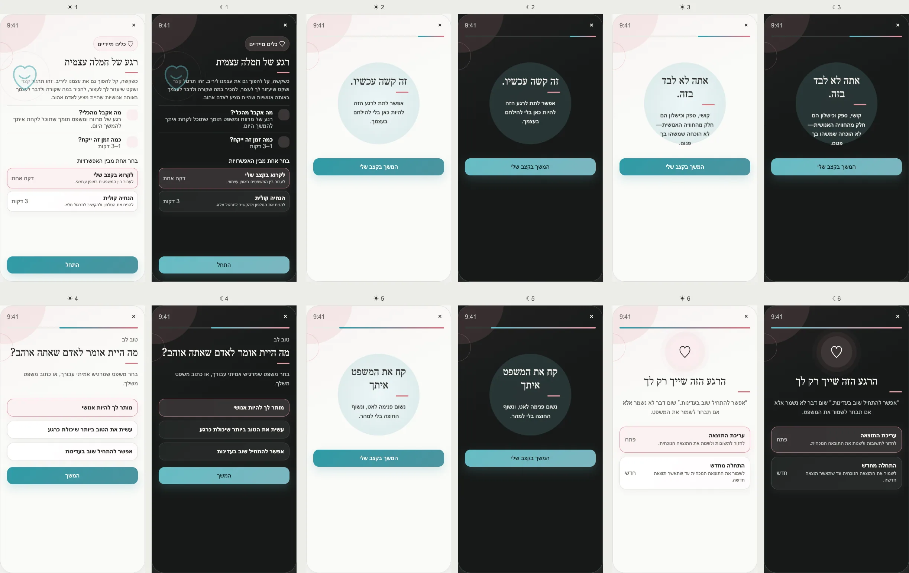

# PRD — A Self-Compassion Moment

Status: **Founder-approved product and UX specification; ready for implementation planning.**
Stage: **POC** for text-led mode; audio requires an approved authored recording and shared media capability.
Type: **Immediate Tool**, not therapy, diagnosis, crisis support, or a course.
Surface: **Tools → Immediate Tools → A Self-Compassion Moment**.
References: [Kristin Neff's Self-Compassion Break](https://self-compassion.org/featuring-original-self-compasion-break-practice/)
and [motivating variant](https://self-compassion.org/practices/motivating-self-compassion-break-2/).

---

## Design reference

## 1. Purpose

Give the user a low-demand, one-to-three-minute way to acknowledge a difficult moment, remember that struggle
is human, and choose a kind but credible sentence to carry forward.

The Tool deliberately learns nothing about the user's problem. It does not require an explanation, analyze
distress, or save content by default.

## 2. Product problem and differentiation

Large wellbeing libraries require browsing when the user has the least attention available. PushApp presents
one immediate path with no setup, score, journal requirement, or pressure to feel better. The design uses very
little chrome and one sentence at a time.

## 3. Opening modes

Show **Choose one of the options**:

1. **Read at my own pace** — user advances manually; approximately 1 minute.
2. **Short audio guidance** — hands-off authored guidance; approximately 3 minutes.

The opening screen contains the Tool value, target icon, clock icon, and visible Start action without scrolling.

## 4. Approved practice

The three semantic components are:

1. **Mindful acknowledgment:** “This is difficult right now.”
2. **Common humanity:** “You are not alone in having moments like this.”
3. **Kindness:** “What would you say to someone you love?”

The user may choose one approved phrase, write a short private phrase, or continue without choosing one. Copy
must remain compassionate without promising relief or minimizing real harm.

## 5. Approved screen inventory

1. **Opening:** value, read/audio choice and duration, Start visible.
2. **Acknowledgment:** one sentence and calm breathing visual.
3. **Common humanity:** one sentence and calm breathing visual.
4. **Kindness:** phrase choices plus optional custom phrase.
5. **Breathing:** carry the selected phrase through three slow breaths.
6. **Finish:** show the chosen phrase; clarify that nothing was saved unless the user chooses Save phrase.

The user can exit at every point. Exit is completion-neutral and never triggers a reminder.

## 6. Audio behavior

- Audio is optional and never auto-plays before Start.
- Provide play/pause, elapsed time, transcript, and device audio-route support.
- Respect silent mode, interruptions, reduced motion, and screen-reader focus.
- If audio fails or is unavailable, offer the complete text mode without error pressure.
- Audio wording is authored and localized; do not synthesize personalized therapeutic guidance in POC.

## 7. Returning behavior

Opening the Tool always starts from its opening screen because it is an immediate practice, not a questionnaire.
If the user deliberately saved a phrase, it may appear as an optional shortcut: **Use my saved phrase**.

No streak, history calendar, completion count, or “you have not practiced lately” message is shown.

## 8. Influence contract

### What becomes knowable

Nothing. This is an approved “influences nothing” Tool under the Tool Addition Protocol.

An optional saved phrase is private user content, not a trait, distress signal, or Coach context.

### Permitted consumers

- current Tool session;
- optional private saved-phrase shortcut.

No Coach, Home, notification, Friend, Ally, Support Circle, Weekly Review, analytics profile, or recommendation
engine may consume the session or infer why it was opened.

### Freshness

Not applicable to sessions. A saved phrase remains until edited or deleted and is never treated as a current
psychological fact.

## 9. Data model

POC can be session-only. Optional entity:

`SavedCompassionPhrase { id, ownerId, encryptedText, createdAt, updatedAt, locale }`.

Do not persist reason, emotional state, screen dwell time, or phrase-selection telemetry tied to identity.

## 10. Safety and edge cases

- The Tool is not emergency support. Settings/help must expose local crisis resources under the shared safety
  policy, but the exercise must not falsely imply it can detect a crisis.
- Do not accept long free text or ask “what happened?” in POC; this reduces sensitive-data and moderation risk.
- If a custom phrase attacks, shames, or threatens the user, do not interpret it; offer neutral authored
  alternatives and allow exit.
- If interrupted, return to the current sentence without marking failure.
- If the user opens repeatedly, do not infer escalating distress.
- Children/minimum-age policy remains governed by account policy; copy avoids clinical claims.
- Offline text mode always works; downloaded audio may work offline under media rules.

## 11. UX, motion, and color

- Category color: **soft coral/rose / immediate care**, never danger red.
- The opening illustration stays in the background and Start remains above the fold.
- Practice screens remove most chrome; the breathing form is the focal point.
- Motion is slow and optional. Reduced-motion mode uses a static circle and timed text.
- Light and dark modes use calm low-contrast surfaces with AA-compliant text.
- Haptics, if used, are optional and disabled with reduced-motion/haptics preferences.

## 12. Analytics and deletion

Allow only coarse anonymous structural analytics such as Tool opened, mode chosen, and session reached finish,
subject to analytics consent. Do not log exit screen, repeated-use patterns tied to identity, phrase choice, or
custom text.

Deleting a saved phrase removes it. Account deletion removes it and any synced audio preference.

## 13. Acceptance criteria

- Text mode completes offline in one minute without entering data.
- Start is visible without scrolling in both opening modes.
- Nothing is saved by default and no downstream system learns why the Tool was opened.
- Audio failure falls back safely to text.
- All six screens, light/dark, RTL, transcript, reduced motion, interruptions, exit, and optional deletion are
  tested.

