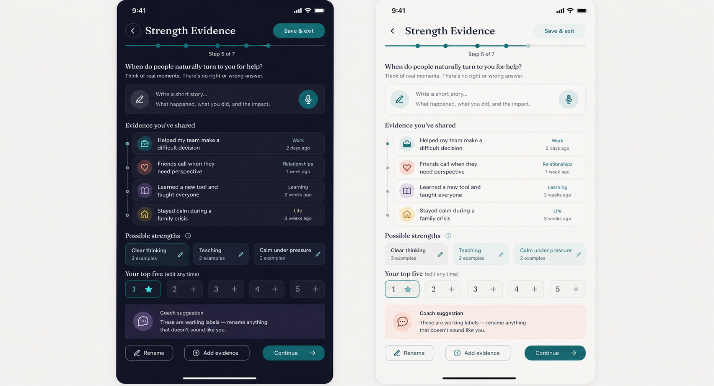

# Strength Evidence — Product Requirements Document

Status: **Founder-approved product specification**

Stage: **Next / Commercial candidate; not an MVP dependency**

Tool type: **Evidence-led reflection, not a validated assessment**

Estimated time: **10–15 minutes; resumable**

Last updated: 2026-08-25

## Purpose and problem

People often describe strengths with flattering labels but cannot connect those labels to real behaviour. Conversely, useful abilities can feel ordinary precisely because they recur naturally. Strength Evidence helps a person collect concrete moments from different parts of life, identify recurring capabilities, and choose language that feels true.

The user walks away with **up to five editable strengths, each grounded in their own examples and confirmed in language that feels true to them**. The user may either analyse their stories manually or ask the Coach to analyse recurring patterns. PushApp does not claim to measure, rank, diagnose, or scientifically validate talent.

This fits PushApp because believable self-knowledge can improve how a person chooses and pursues a Dream. Complexity comes from clustering evidence, optional Coach suggestions, private storage, editing, and downstream permissions—not from scoring.

## Goals

- Replace abstract self-rating with specific behavioural evidence.
- Surface strengths across childhood, work or learning, relationships, recurring requests for help, and difficult moments.
- Offer a clear choice between self-analysis and smart analysis by the Coach.
- Let the user—not the system—make the final decision by confirming, renaming, merging, ordering, or removing candidate strengths.
- Preserve an approved result that can support Coach conversations and personalised motivation only with explicit, reversible permission.

## Non-goals

- Producing a psychometric profile, score, percentile, type, diagnosis, or comparison.
- Recreating CliftonStrengths, VIA, HIGH5, or the supplied worksheet wording.
- Proving that a strength is permanent.
- Automatically creating or changing a Dream, Journey, Milestone, Step, reminder, or Coach agenda.
- Treating frequency of evidence as objective strength magnitude.

## User stories

- As a user who struggles to name strengths, I want prompts tied to real moments so my answer feels earned.
- As a user who dislikes a suggested label, I want to rename it without losing its evidence.
- As a user who wants help recognising patterns, I want the Coach to analyse my stories and explain the evidence behind each proposed strength.
- As a user who prefers private self-reflection, I want to complete the same tool manually without sending my stories to the server.
- As a returning user, I want to see my current result or resume an unfinished reflection.
- As a user, I want to delete an example or the complete result and understand what downstream context is removed.

## Entry and return

### First entry

The Tools card states the outcome, reflection status, estimated time, privacy summary, and that progress is saved. `Begin` opens a short orientation: examples matter more than polished writing; voice is optional; no answer is right or wrong. Before analysis, the user chooses between `Analyse with Coach` and `Analyse myself`; each option includes a short explanation of its privacy and effort implications.

### Return with a draft

Open a return screen showing progress, last-edited time, and three actions: `Continue`, `Review what I added`, and `Start again`. Starting again requires confirmation and explains that it replaces the draft only.

### Return after completion

Open the current strength summary, with `Add evidence`, `Edit strengths`, `Talk to Coach`, `Delete result`, and `Start again`. A new run must not silently overwrite the current completed result; it remains active until the replacement is confirmed.

## Detailed flow

1. **Orientation.** Explain reflection status, estimated time, save/resume, and that the user will later choose between manual and smart analysis.
2. **Evidence prompts.** One cognitive operation per screen. Prompt across: an early memory; work or learning; relationships; something people seek help with; a hard situation; and an accomplishment that felt natural. The user may type or dictate a short story, skip a prompt, and tag its life context.
3. **Evidence review.** Show editable evidence cards. Each card contains the user's wording, optional context, and date added. The user can add, edit, delete, or reorder. The tool recommends several concrete stories from varied contexts but does not invent a universal minimum that blocks analysis.
4. **Choose analysis mode.** Present two equal options:
   - **Analyse with Coach:** the raw stories are sent for one-time server-side analysis after explicit consent. The Coach identifies recurring capabilities and links each proposed strength to supporting stories.
   - **Analyse myself:** all grouping and labelling remain manual and can work without a network connection.
5. **Insufficient evidence in smart analysis.** If the Coach cannot support five credible strengths, show a non-blocking message recommending more stories for a fuller result. The user may add stories or continue and receive fewer than five results. The system never creates filler strengths.
6. **Candidate grouping.** In smart mode, the Coach proposes evidence-linked labels. In manual mode, the user creates labels and assigns stories. In both modes, ungrouped evidence is allowed.
7. **User confirmation.** The user confirms one to five strengths and may accept, reject, rename, merge, reorder, or manually add a candidate. A strength requires at least one attached example. Nothing becomes a saved insight before confirmation.
8. **Meaning and application.** For each chosen strength ask, `When does this help you?` and optionally `When can too much of it get in the way?` These are reflection fields, not judgments.
9. **Review and confirm.** Show all confirmed cards and their evidence. The user confirms the complete result and chooses whether approved strengths may personalise future Coach conversations and motivational messages.
10. **Result.** Present a quiet, editable evidence map—not a reveal, grade, or celebration for “being strong.”

### Content limits

- Each evidence story: **600 characters maximum**. Show a counter from 480 characters and never truncate silently.
- Strength label: **30 characters maximum**.
- Each optional application reflection: **240 characters maximum**.
- Dictation follows the same limits and stops with a clear explanation when the limit is reached.
- These limits keep the tool focused on concrete evidence rather than long-form journaling; the user may add another story instead of extending one indefinitely.

## Result and downstream use

The result contains up to five user-confirmed strength labels, local supporting-example references, optional user-written application notes, and the analysis mode used. Raw stories remain private by default and are never retained server-side after smart analysis.

### Approved influence contract

- **Unique knowledge:** capabilities the user recognises because they recur in lived examples, not merely interests or onboarding claims.
- **Smallest derived summary:** `{ takenAt, analysisMode, strengths: [{ userLabel, evidenceCount }] }`; no story text, quotations, context details, or application notes.
- **Permitted readers:** the Coach and the Personalized Motivation Engine, only after explicit permission, to frame support around capabilities the user has confirmed. The summary is context, never an agenda or authority.
- **Validity:** the confirmed result remains available until the user edits, replaces, or deletes it. There is no automatic 180-day expiry.
- **Permission:** the result screen offers a clear option to use confirmed strengths to personalise the Coach and motivational messages. The user can revoke this permission later in Settings.
- **Propagation:** edits, replacement, deletion, or permission withdrawal must immediately update or revoke downstream derived context.
- **Never:** downstream raw-story access, silent Dream/Journey/Milestone/Step creation or change, unsupported claims, Buddy reactions, scoring, comparison, or claims of assessment validity.

## UX requirements — light and dark

- Follow the current display voice: Fraunces for English headings, Frank Ruhl Libre for Hebrew headings, Inter for body and controls, with fixed role line heights.
- Use one screen/one job, generous whitespace, one subject per card, and hairlines within cards rather than nested boxes.
- Teal indicates selection and real growth; evidence categories use restrained secondary accents with text/icon labels so colour is never the only meaning.
- The dark theme uses deep ink surfaces and readable muted copy; the light theme uses near-white canvas and white cards with visible edges. Both must meet WCAG AA.
- Provide 44px minimum targets, Dynamic Type, screen-reader labels, keyboard-safe layouts, RTL mirroring, reduced-motion support, and non-colour progress semantics.
- Voice capture must always have an equivalent text path and clear recording state.

## Data and privacy

- Store drafts, raw evidence, user labels, notes, and result locally by default through the Repository abstraction.
- Raw evidence must never be included in analytics, logs, notification copy, or derived signals.
- Manual analysis remains local and requires no raw-story transmission.
- Smart analysis requires a deliberate user action and a just-in-time explanation that the raw stories will be processed securely on the server to produce proposed strengths.
- In smart mode, raw stories may exist server-side only in memory for the duration of the analysis request. They must not be written to a database, object storage, queue, cache, prompt archive, trace, analytics event, crash report, or application log.
- The selected AI provider and configuration must provide zero-retention or equivalent contractual and technical controls. Provider training, human review, and request logging containing raw stories are prohibited for this flow.
- Only the user-confirmed derived result may be stored as an insight. Rejected candidates and raw model output are not retained as user insights.
- Coach and Motivation Engine access requires an explicit result-level choice; withdrawing it removes the derived context from both readers.
- Support per-example deletion, full-result deletion, draft reset, and account deletion/export obligations.
- If connectivity fails, the smart path preserves the local draft and offers retry or manual analysis. It must never silently fall back to a different provider or weaker privacy mode.

## Edge cases

- Fewer than five credible strengths: allow one to four; never add filler.
- Too little evidence for smart analysis: explain that the result may be partial, offer `Add more stories` and `Continue anyway`, and record no failure or negative judgment.
- Smart analysis returns no defensible candidate: preserve the draft, invite more evidence, and offer manual analysis; do not fabricate a result.
- One example supports several labels: allow linking without duplicating raw text.
- Several labels mean the same thing: suggest merge, never auto-merge.
- User disputes every suggestion: permit manual labels and completion without Coach suggestions.
- User changes analysis mode after receiving proposals: discard unconfirmed proposals and preserve the local stories.
- Server or provider retains payloads by default: the smart-analysis mode must remain disabled until zero-retention controls are verified.
- Voice permission denied or transcription fails: retain no unusable audio and offer text immediately.
- RTL mixed with numbers or English strength labels: preserve logical reading order.
- App closes mid-entry or storage fails: recover the last durable draft and explain any unsaved content.
- A shared result is edited or deleted: recompute or revoke the derived summary immediately.

## Success metrics and instrumentation

Success means users produce evidence-backed language they retain or deliberately use—not that they spend more time in the tool.

- Completion among starts; draft-resume success; proportion of selected strengths with at least two examples; label-edit rate; voluntary Coach-share rate; result revisit or purposeful downstream use within 30 days.
- Guardrails: reset/delete rate, abandonment by step, voice failure rate, and share withdrawal rate.

Events (never include answer text, strength labels, story text, model output, or notes): `tool_strength_evidence_viewed`, `tool_strength_evidence_started`, `tool_strength_evidence_draft_saved`, `tool_strength_evidence_resumed`, `strength_evidence_added`, `strength_evidence_edited`, `strength_evidence_deleted`, `strength_analysis_mode_selected`, `strength_smart_analysis_requested`, `strength_smart_analysis_partial`, `strength_candidate_suggested`, `strength_candidate_accepted`, `strength_candidate_rejected`, `strength_candidate_renamed`, `strength_candidate_merged`, `strength_selected`, `tool_strength_evidence_completed`, `tool_strength_evidence_result_viewed`, `tool_strength_evidence_personalisation_set`, `tool_strength_evidence_reset`, `tool_strength_evidence_deleted`, `tool_strength_evidence_error`.

Allowed properties are coarse: step number, entry source, input mode, evidence count bucket, selected-strength count, suggestion accepted/edited/rejected, share state, duration bucket, theme, language, and error code.

## Acceptance criteria

- The card identifies this as a reflection, gives an estimated time, and says it is resumable.
- The user can type, dictate, skip, save, exit, and resume without losing confirmed content.
- Completion supports one to five strengths, each with at least one user-owned example.
- The user can choose manual or smart analysis without either option being visually framed as inferior.
- Smart analysis is explicit, evidence-linked, and may return fewer than five strengths when evidence is insufficient.
- Suggested labels are explained, editable, removable, and never presented as validated findings.
- The result is editable and private by default; Coach and Motivation Engine personalisation is explicit and reversible.
- Smart-analysis raw stories are not retained by PushApp infrastructure, providers, logs, monitoring, traces, queues, or analytics; this is verified before release.
- No raw answer appears in analytics or downstream signals.
- Light, dark, English, Hebrew/RTL, Dynamic Type, VoiceOver/TalkBack, and reduced motion pass QA. Manual analysis works offline; smart analysis clearly requires connectivity.
- Reset and deletion behave as described, including revocation of derived context.

## Test scenarios

1. Complete manually with five diverse examples and five user-created labels.
2. Request smart analysis with insufficient evidence, continue anyway, and receive only defensible candidates.
3. Save at every step, force-close, relaunch, and resume exactly where left.
4. Deny microphone permission, fail transcription, and finish by typing.
5. Enable Coach and Motivation Engine use, edit a label, then withdraw permission and verify both derived contexts update/remove.
6. Delete one linked example and verify affected strengths remain truthful or request repair.
7. Run offline in both themes and both directions with large text and screen reader.
8. Inspect analytics payloads and logs to confirm no raw stories, labels, or notes are emitted.
9. Inspect server, provider, queue, trace, crash-report, and monitoring configurations and retention evidence to prove raw smart-analysis payloads are not retained.
10. Fail connectivity before and during smart analysis; verify the local draft survives and manual analysis remains available.

## Competitors and references

- [Gallup CliftonStrengths](https://support.gallup.com/hc/en-us/articles/44814767818643-What-is-the-CliftonStrengths-assessment): strong validated talent-theme model; not a model PushApp should imitate without licensing and validation.
- [VIA assessments](https://www.viacharacter.org/researchers/assessments): useful benchmark for transparent research status and instrument boundaries.
- [HIGH5](https://high5test.com/features/): useful pattern of connecting strengths to stories, peer evidence, and application rather than stopping at labels.
- Internal research: `05_Research/Coaching_Tools_Digitization_Competitive_Research_2026-08-20.md` §3.4.
- Governing rules: `04_Product/Tool_Addition_Protocol.md`; `04_Product/Design_System.md`.

## Related tasks

- **Draft / unassigned:** write original English and Hebrew prompts and accessibility labels.
- **Draft / unassigned:** design the local model, ephemeral smart-analysis endpoint, Repository storage, result deletion, and signals audit.
- **Draft / unassigned:** verify zero-retention provider settings and add automated redaction/absence tests across logs, traces, analytics, crash reporting, and queues.
- **Related PRD:** `../Future/Personalized_Motivation_Engine_PRD.md` must consume only the approved minimal summary and must honour permission withdrawal; it must never receive raw stories.
- **Draft / unassigned:** implement and QA analytics events listed above.
- Any additional future consumer requires a new explicit influence decision.

## Product decisions

- **Approved, repository-wide:** a Tool must give user value and declare an influence contract; it never creates product objects or nags by itself.
- **Approved, repository-wide:** raw Tool answers are on-device by default and Tools do not score, grade, or compare.
- **Approved, 2026-08-25:** the user chooses between manual self-analysis and smart analysis by the Coach.
- **Approved, 2026-08-25:** smart-analysis raw stories are processed server-side without retention; only the user-confirmed derived insight is stored.
- **Approved, 2026-08-25:** insufficient evidence yields a transparent partial result rather than filler; the user may add stories or continue.
- **Approved, 2026-08-25:** confirmed strengths remain current until edited, replaced, or deleted; no automatic expiry applies.
- **Approved, 2026-08-25:** the user may explicitly allow confirmed strengths to personalise the Coach and motivational messages, and may revoke that use.
- **Approved, 2026-08-25:** evidence stories are capped at 600 characters, strength labels at 30, and application reflections at 240.

## Future Vision

- A separately licensed validated assessment, clearly distinguished from this reflection.
- On-device smart analysis that preserves the same transparent evidence links without transmitting raw stories.
- User-requested comparison between dated maps, framed as change rather than improvement or decline.

## Open Questions

None. Provider selection is an implementation decision gated by the approved zero-retention, privacy, security, and cost requirements above; it cannot weaken those requirements.
