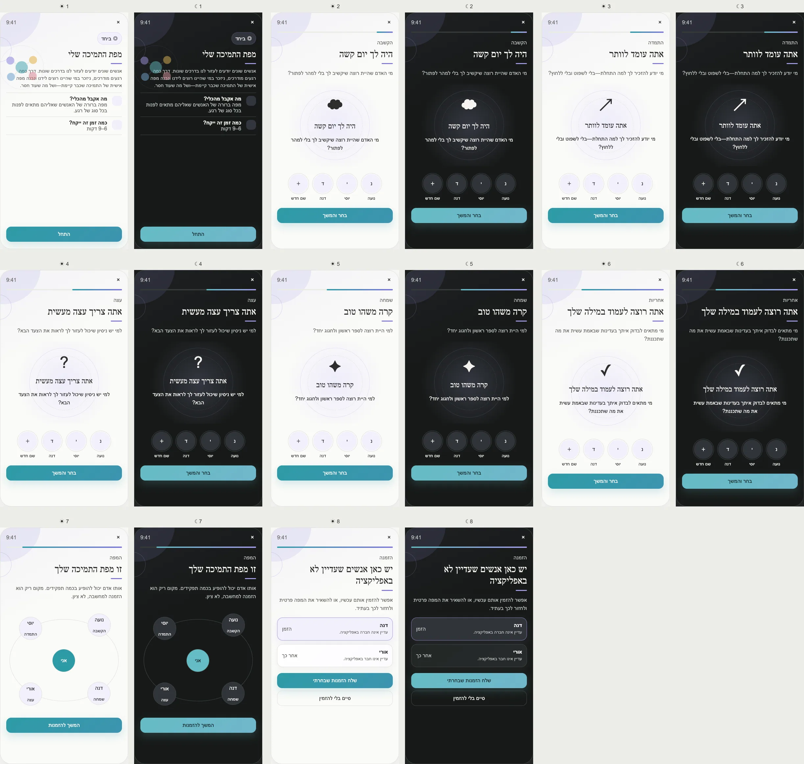

# PRD — My Support Map

Status: **Founder-approved product and UX specification; core reflection ready for implementation planning;
invitations remain dependency-gated.**
Stage: **POC** for private mapping; invitation actions depend on the approved acquisition and delivery
infrastructure.
Type: **Guided social reflection**, not relationship scoring.
Surface: **Tools → Together → My Support Map**.
Related: Friends, Allies, Support Circle, Invite Friend Acquisition, Inbox, notifications, blocking/reporting.
References: [Columbia Social Support Network Map](https://ssnm.ctl.columbia.edu/) and the
[interactive reference](https://ssnm.ctl.columbia.edu/map/interactive/).

---

## Design reference

## 1. Purpose

Help a user identify which people they would genuinely want beside them in different moments, and what kind of
support each person may be suited to provide.

The Tool maps the user's perception. It does not claim that a named person has agreed, is available, is safe,
or should become a Friend or Ally.

## 2. Product problem and differentiation

Traditional social-network maps begin with “Who is in your life?” and produce a static clinical diagram.
PushApp begins with vivid, humane situations. Guided imagination makes recall easier and reveals that listening,
practical advice, celebration, encouragement, and accountability may come from different people.

The result connects naturally to PushApp's social pillar without converting reflection into automatic social
actions.

## 3. User outcome

The user leaves with an editable map of named people and support roles, including honest gaps where no person
currently comes to mind.

Estimated duration: **6–9 minutes**.

## 4. Person selection

For every guided situation the user may:

- select a Friend from the in-app Friend list;
- type a short private name for someone not in the app;
- choose **No one comes to mind right now**;
- assign the same person to several roles;
- select more than one person where appropriate.

Typed names are labels for the user's private map, not shadow user accounts or contact records. Do not request
Contacts permission merely to type a name.

## 5. Guided-imagination scenarios

Approved scenario set:

1. **Listening:** “You had a difficult day. Who would you want to listen without rushing to solve it?”
2. **Persistence:** “You are about to give up. Who can remind you why you started without judging or pushing?”
3. **Practical advice:** “You need to see the next step. Whose experience might help?”
4. **Celebration:** “Something good happened. Who would you want to tell first?”
5. **Accountability:** “You want to keep your word. Who could check in gently?”

These are prompts, not eligibility rules for Ally roles. The future Accountability Ally remains a separate
product contract.

## 6. Approved screen inventory

1. **Opening:** value, target outcome, 6–9 minute estimate, Start visible without scrolling.
2. **Listening scenario:** guided visualization and Friend/manual-name selection.
3. **Persistence scenario.**
4. **Practical-advice scenario.**
5. **Celebration scenario.**
6. **Accountability scenario.**
7. **Map result:** user in the center, people and support-role labels around them.
8. **Invitation review:** only non-members appear; invite selected people or finish without inviting.

Every scenario allows Back, Skip, exit/resume, and **No one right now**.

## 7. Map behavior

- A person may carry several role icons.
- The same display name may represent different people; manual entries receive separate internal IDs.
- Empty roles remain visible as gentle gaps, never red warnings.
- The map has a list alternative for screen readers and users who prefer text.
- Drag is never required; editing uses accessible role menus.
- Returning entry opens the current map with Edit, Invite, Start over, and Delete.

## 8. Invitation behavior

After confirmation, the Tool may ask whether the user wants to invite people who were typed manually.

- Each invite is separately selected and confirmed.
- The invitation is to **join PushApp**, not automatic consent to become a Friend or Ally.
- Joining does not expose that person to the map.
- The map entry is not automatically linked to a newly registered account. PushApp may propose a match and ask
  the user to confirm it.
- Friend request and Support Circle request remain independent actions and may later be presented together
  where their own PRDs allow it.

Dependencies:

- `../Invite_Friend_Acquisition_PRD.md` for free deferred invitation behavior;
- `../Future/Tool_Invitation_Inbox_and_Push_Delivery_PRD.md` for in-app/push delivery where applicable.

Until those dependencies work, the core map ships without claiming an invite was sent.

## 9. Influence contract

### What becomes knowable

The people the user currently associates with five support roles and the roles for which nobody came to mind.

### Smallest derived summary

`{ confirmedAt, mappedRoleCount, unfilledRoles[], inAppFriendCount, externalLabelCount }`

Names and relationship details are excluded from general user-model summaries.

### Permitted consumers

- Tool result: full private map;
- invitation action: only explicitly selected external labels;
- Friend/Support Circle flows: only after the user deliberately starts that action from a selected person.

The Coach, Home, notifications, matching, and other Tools do not read the map by default.

### Prohibited automatic effects

Never add/remove a Friend, Ally, Support Circle member, contact, or message recipient; never infer relationship
quality, loneliness, popularity, or mental-health risk.

### Freshness

The map is current for **90 days**. It remains visible after that but is labelled ready for review before being
used as invitation context.

## 10. Data model

Suggested entities:

- `SupportMap { id, ownerId, status, confirmedAt, updatedAt, schemaVersion }`;
- `SupportMapPerson { id, source: friend | manual, friendId?, privateLabel, createdAt }`;
- `SupportMapRole { personId, role, addedAt }`;
- `SupportMapInvitationLink { personId, invitationId?, state }`.

Manual labels are encrypted private Tool content. They are not searchable profiles and never enter analytics.

## 11. Edge cases

- No Friends: manual names and **No one right now** keep the Tool fully usable.
- Friend removed: preserve a private manual-style map label only after explaining the change; do not recreate
  friendship.
- Blocked user: remove invitation/action affordances and prevent re-identification through the Tool.
- Duplicate name: never merge automatically.
- One person in every role: allowed; the result should not imply broader support than the user recorded.
- No person in any role: provide a valid, compassionate result without pressure to invite strangers.
- Invite declined/expired: map remains unchanged; show delivery state only where invitation rules permit.
- Account deletion removes the map; deleting the map does not affect Friends or Allies.
- Offline mapping works; invitations wait for connection and explicit confirmation.

## 12. UX, color, and accessibility

- Color family: **purple / togetherness and relationships**; never a status score.
- Each scenario uses one spacious focal illustration and one action area.
- Profile images use real Friend photos when permitted; otherwise initials.
- Light/dark modes preserve role labels, map lines, and avatar contrast.
- Screen readers receive the scenario, selected names, role, and map as an ordered list.
- Reduced-motion mode removes orbit motion; the map remains static and complete.

## 13. Privacy, safety, and analytics

The map is highly sensitive social data. It is private by default, excluded from Coach context, Friends,
Circle, support score, and matching. Invited people never learn how the user categorized them unless later copy
explicitly says so and the user chooses to disclose it.

Analytics may record structural counts and invitation opt-in, never names, Friend IDs, role/name pairings, or
the existence of a specific relationship.

## 14. Acceptance criteria

- The complete reflection works with zero Friends and without Contacts permission.
- Start is visible without scrolling on the opening screen.
- Every invite is optional, individually selected, and dependency-backed.
- No map change mutates the social graph.
- All eight screens, RTL, light/dark, list alternative, resume, reset, deletion, and blocked-user behavior are
  tested.

