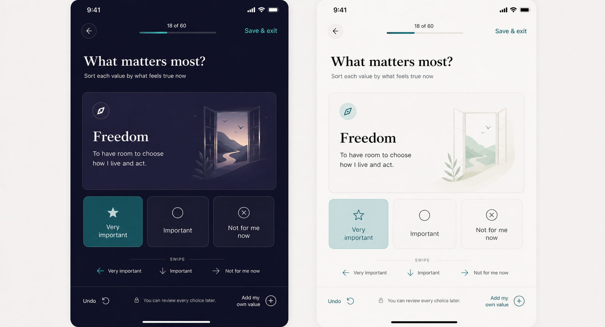
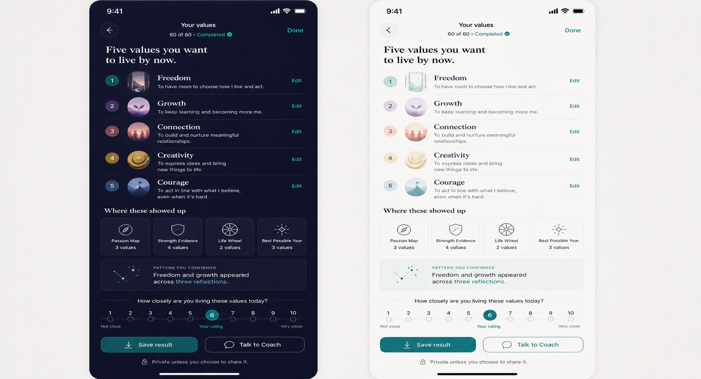

# PRD — Values Sort

Status: **Draft product and UX specification; no founder approval is inferred. Influence contract is owed.**  
Stage: **MVP candidate**  
Surface: **Tools → Values Sort**  
Category: **Know yourself**  
Estimated time: **10–15 minutes; resumable**

The second image is the result state of this same Tool. Values Summary is not a separate Tools tile or PRD.

## 1. Purpose and product problem

Values Sort helps a person make real trade-offs and leave with five ordered values defined in their own
words. A checklist makes almost everything feel important; a forced, reversible sort reveals what feels most
important in the person's current season without claiming a permanent identity.

It is reflection, not a validated assessment. Its result can give the user durable language for choices and,
only under an approved influence contract, may support Coach conversations.

### Feature-proposal checklist

- **Problem:** broad value lists encourage over-selection and generic labels.
- **Why needed:** narrowing and personal definitions turn abstract ideals into usable self-knowledge.
- **Improves:** Tools and potentially Coach context; Values Summary is part of this result, not another tile.
- **Complexity:** licensed/public-domain source set, 60+ card flow, resume/undo, narrowing/ranking, custom
  values, accessibility, privacy, and a still-unapproved influence contract.
- **Philosophy fit:** chosen values can clarify who someone wants to become, without grading alignment or
  manufacturing engagement.
- **Stage:** MVP candidate; sequencing remains open.

## 2. Goals and success signals

1. Make broad sorting fast, understandable, and fully reversible.
2. Narrow through genuine trade-offs to ten and then five values.
3. Let the user rank and personally define each final value.
4. Produce a private, editable result without converting it into a Dream or Journey.

Primary success signal: the user confirms five values and provides a personal definition for at least one,
then reports the result feels usable (optional one-tap usefulness check). Secondary: an explicitly chosen
Coach handoff results in a substantive conversation, once such access is approved.

### Analytics events to instrument

Never log value names, definitions, pile membership, rankings, custom text, or alignment ratings.

| Event | Properties |
|---|---|
| `tool_values_sort_opened` | `entry_point`, `has_result`, `has_draft` |
| `tool_values_sort_started` | `deck_version`, `card_count_bucket`, `locale`, `theme` |
| `tool_values_sort_card_sorted` | `card_index`, `pile: very|important|not_now`, `sorted_count` |
| `tool_values_sort_undo_used` | `stage: broad|narrow|rank` |
| `tool_values_sort_custom_added` | `stage`, `custom_count` |
| `tool_values_sort_saved_exit` | `stage`, `progress_bucket` |
| `tool_values_sort_resumed` | `stage`, `days_since_save_bucket` |
| `tool_values_sort_narrowing_completed` | `from_count`, `to_count` |
| `tool_values_sort_result_confirmed` | `definition_count`, `alignment_rating_count`, `elapsed_bucket` |
| `tool_values_sort_result_viewed` | `result_age_bucket` |
| `tool_values_sort_handoff_selected` | `destination: coach` |
| `tool_values_sort_reset_confirmed` | `had_result` |
| `tool_values_sort_deleted` | `scope: draft|result|all` |

## 3. Non-goals

- Producing a personality type, moral score, ideal-value prescription, or comparison with others.
- Copying the founder-supplied branded value bank without confirmed rights.
- Making Values Summary a separate Tools tile.
- Automatically changing Coach behavior, Dreams, Journeys, Steps, reminders, or notifications.
- Treating `Not for me now` as rejection forever or low value as a deficit.

## 4. Entry and return behavior

First entry explains `about 10–15 minutes`, the three piles, undo, custom values, privacy, and that the result
can change. A draft resumes at its exact card/stage. **Save & exit** is always visible; **Start over** requires
confirmation.

With a confirmed result, entry opens Values Summary: five ranked values, personal definitions, optional
current-alignment reflections, and result date. Actions: **Edit definitions**, **Review my sort**, **Take
again**, **Talk to Coach** (only after influence approval), **Delete**. A new run stays draft until confirmed
and cannot overwrite the current result accidentally.

## 5. Detailed flow

### 5.1 Orientation and source set

Use a confirmed public-domain or licensed set with original PushApp names/definitions. Show deck size and
estimated time. Deck version is stored with the result. Exact deck and localization require legal/content
review.

### 5.2 Broad card sort

Show one card at a time with a concise value name, plain-language original definition, and restrained
illustration/icon. The user chooses **Very important**, **Important**, or **Not for me now** by button, swipe,
keyboard/switch equivalent, or screen-reader action. Swipes are shortcuts, never the only control. Always show
progress, **Undo**, **Save & exit**, and **Add my own value**.

The pile wording explicitly means `in this season`, not permanent identity. The user may inspect and move any
previous card. A custom value requires a short name and optional definition; duplicate detection suggests
merge but does not force it.

### 5.3 Review piles

Show each pile as a simple list rather than nested cards. The user can search, move, edit custom entries, and
continue. If fewer than ten are in Very important, the user may promote values from Important.

### 5.4 Narrow to ten, then five

The user chooses ten from the combined priority pool, then five from those ten. The interface uses paired
choices or an unranked selection tray to create genuine trade-offs; it must not calculate a hidden score.
Blocking occurs only when more than the target remains, with neutral copy and no countdown.

### 5.5 Order and define

The user orders the final five via drag or accessible move controls. For each, ask `What does this mean in
your life?` Definition is encouraged but optional; source definition remains visibly distinct from the
user's words. Optionally ask `How closely are you living this right now?` on a labelled 1–5 reflection scale,
never presented as a score or included in influence until approved.

### 5.6 Confirm

Preview Values Summary and explain exactly what is saved and who can read it. Until the influence contract is
approved, the answer is **only the user**. Confirmation makes this result current.

## 6. Result and downstream use

Values Summary contains the ordered five, each personal definition, optional current-alignment reflection,
date, and deck version. It supports editing definitions without silently re-running the sort. A historical
comparison may later show wording/order changes neutrally.

The influence contract is **Open and required before release**. Draft candidate for founder review:
`{ takenAt, topValueIds, userDefinedCount }`, with IDs only from the rights-cleared canonical deck and no
personal definitions. Candidate reader: Coach, only after a per-result **Share with Coach** action, to ask
better relevance questions—not to steer, label, or create. Candidate staleness: 180 days. None of these
candidate details are approved; until then, the result influences nothing outside Values Sort.

## 7. UX specification — light and dark

The image is a **design concept**. It establishes a calm one-card-at-a-time interaction, clear progress,
three equally available actions, persistent undo, and custom entry. Display headings/card names use the
language-specific serif; body and controls use Inter. One subject occupies one card; controls below are not
nested into extra decorative surfaces.

- **Light:** near-white page, white card with hairline edge, dark ink, subtle illustration, and teal tint only
  on the chosen pile.
- **Dark:** deep neutral/navy page, clearly edged card, high-contrast type, muted illustration, and teal chosen
  state without luminous overload.
- Every pile has text + icon + selected state; never color alone. Targets are at least 44px. RTL mirrors
  navigation/swipe hints and text, not semantic pile meaning. Dynamic Type permits the illustration to shrink
  or disappear before copy truncates. Reduced Motion changes swipe animation to a quick fade/slide.

## 8. Data, privacy, and rights

Raw choices, custom values, definitions, rankings, and ratings remain on device by default. Analytics contains
only non-content events above. Export/delete cover drafts, historical results, deck version, and any future
derived summary. The flow must display the reader list before confirmation and sharing. No Coach, Ally,
Support Circle, or server receives raw answers.

The value set must be demonstrably public-domain or licensed, with original PushApp definitions and art.
Providing a PDF is not evidence of rights. Deck source/version and attribution requirements must be recorded.

## 9. Edge cases

- Too few cards in Very important: allow promotion; do not infer selections.
- More/fewer than target after edit: return to neutral narrowing state.
- Duplicate custom/source value: suggest merge while preserving the user's distinct meaning if declined.
- Deck updates after a saved draft: finish with its stored version; do not reorder or substitute cards.
- Translation changes meaning/length: content review per locale; never machine-truncate value names.
- Accidental swipe: immediate undo plus full review.
- User defines none: confirm valid result and offer later editing.
- User selects fewer than five after deletions: label result incomplete; do not invent replacements.
- Screen reader/large type: illustration yields space and all swipe operations have named actions.

## 10. Acceptance criteria

1. A user can sort every card into three piles via tap and accessible alternatives, undo/review any choice,
   save/exit, and resume exactly.
2. The flow narrows to ten then five without hidden scoring, ranks the five, and supports optional personal
   definitions and alignment reflections.
3. A custom value can be added, edited, merged by choice, ranked, defined, exported, and deleted.
4. The current result is never replaced until confirmation; restart is recoverable.
5. No raw content appears in analytics or leaves the device.
6. Shipping is blocked until the deck rights and influence contract are approved and implemented.
7. Light/dark, English/Hebrew RTL, Dynamic Type, screen reader, switch/keyboard, and reduced motion pass QA.

## 11. Test scenarios

- Sort a full deck with taps, swipes, undo, review, save/exit, and resume.
- Put almost everything in Very important and verify staged narrowing with no score.
- Add a custom value duplicating a source value; accept and decline merge in separate runs.
- Change locale/theme mid-draft and verify stable card identity and readable layout.
- Upgrade deck version while a draft exists and verify the draft remains internally consistent.
- Complete with no definitions and with all definitions; verify both are valid.
- Try Coach handoff before influence approval and verify it is unavailable/no data is exposed.
- Inspect analytics, export, one-result deletion, and delete-all for content leakage.
- Complete with screen reader and largest text without swipe.

## 12. Competitors and references

- [My Values Card Sort](https://myvaluescardsort.com/) — 83-card, three-pile sorting, narrowing, ranking,
  personal definitions, save/resume, and privacy.
- [Values Card Sort](https://www.valuescardsort.com/) — visual card-oriented interaction.
- [Personal Values Card Sort](https://personalvalues.net/) — source/reference for a digital value-sort model.
- Internal research: `../../../05_Research/Coaching_Tools_Digitization_Competitive_Research_2026-08-20.md`
  §3.2.

My Values Card Sort is the strongest cited pattern because it carries the user from broad sorting through
personal definition rather than ending at a pile. PushApp should borrow the forced trade-offs, resume, and
privacy, while improving downstream agency through an explicit, auditable influence contract.

## 13. Related tasks and dependencies

- Confirm rights-cleared deck, original definitions, illustrations, attribution, and Hebrew review.
- Founder decision and code implementation for the Values influence contract.
- Values Summary result UI (inside this tool, never a separate tile).
- Tool model/store/signals, export/deletion, analytics, accessibility, and QA.
- Coach sharing/permission UI only if explicitly approved.

## 14. Decision register

### Product Decisions (Approved)

- Every tool needs value plus an explicit influence contract; raw answers stay on device.
- Values Summary belongs inside Values Sort, not as a separate Tools tile.
- Supplied branded wording cannot be copied without rights; original wording/order are required.
- A tool never creates or changes Dreams, Journeys, Steps, reminders, or notifications automatically.

### Future Vision

- Neutral comparison between dated confirmed results.
- Optional enrichment from other confirmed tool results, only with explicit approval.

### Open Questions

- Which public-domain/licensed deck, card count, definitions, and art ship?
- Does the draft candidate influence contract in §6 become approved, and is sharing per result?
- Is the optional alignment reflection in MVP, and may any downstream reader ever use it?
- How long do confirmed historical results persist, and when does a derived summary go stale?
- Is Values Sort among the first implemented MVP tools?
