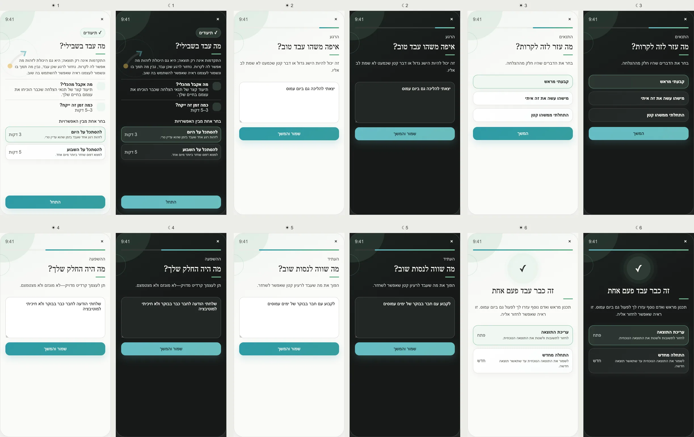

# PRD — What Worked for Me?

Status: **Founder-approved product and UX specification; ready for implementation planning.**
Stage: **POC**.
Type: **Private evidence reflection**.
Surface: **Tools → Records → What Worked for Me?**
Related: Weekly Review, Journal/Records, Journeys, Coach Conversation.
Research basis: positive-event reflection and personal-project evidence; see
[Three Good Things](https://ggia.berkeley.edu/practice/three-good-things) for a related causal-reflection pattern.

---

## Design reference

## 1. Purpose

Help a user identify one real moment that went well, understand what supported it, recognize their own
contribution, and save one condition worth trying again.

This is not a success diary, performance score, or claim that repeating the same condition guarantees the same
outcome.

## 2. Product problem

People often remember that something worked but not why. Generic praise does not teach them what they can
repeat. PushApp turns one success into user-owned evidence: context, support, contribution, and a small reusable
idea.

## 3. Opening options

Show **Choose one of the options**:

1. **Look at today** — one fresh moment; approximately 3 minutes.
2. **Look at the week** — identify a repeated pattern; approximately 5 minutes.

Both options include descriptions and time. Start remains visible without scrolling.

## 4. Approved screen inventory

1. **Opening:** value, daily/weekly routes, Start.
2. **The moment:** “Where did something work well?”
3. **Supporting conditions:** select or write what helped—planning, environment, another person, timing,
   smaller first action, or custom factor.
4. **My contribution:** specific credit for what the user did.
5. **Use it again:** one optional idea worth repeating.
6. **Result:** evidence statement with Edit, Start over, and Delete.

The weekly route may collect up to three moments before asking what repeated. It must not require three moments
to finish honestly.

## 5. Entry from Weekly Review

Weekly Review may offer this Tool as an optional deeper reflection and pass only the selected week dates. It
does not prefill a “success,” read the answers, or require Tool completion before Weekly Review approval.

The result does not automatically enter Weekly Review. The user may copy or explicitly share a confirmed
reusable idea in a future approved influence flow.

## 6. Returning and history

Return opens a reverse-chronological private list of confirmed evidence records. The latest record opens first.
Actions: View, Edit, Repeat for today/week, and Delete.

There is no streak, missed-entry marker, completion target, or pressure to produce a positive event every day.
If nothing comes to mind, the user may exit without creating an empty record.

## 7. Influence contract

### What becomes knowable

Nothing enters the general user model. Under Decision D66, the reflection is for the user.

The private result may include a moment, supporting conditions, the user's contribution, and a reusable idea.

### Permitted consumers

- Tool result and private record history only.
- A future explicit **Discuss this record with the Coach** action would require preview and approval; it is not
  part of the POC contract.

### Prohibited automatic effects

Never modify a Journey or Step, award progress, create a reminder, recommend a person, or turn a correlation
into a causal fact.

### Freshness

Each record remains true as a dated reflection. A reusable idea is not treated as current context after
**90 days** unless reconfirmed.

## 8. Data model

Suggested `WhatWorkedRecord`:

- `id`, `ownerId`, `periodType: day | week`, `periodStart`, `periodEnd`;
- encrypted `moments[]`, `supportingConditions[]`, `ownContribution`, `repeatIdea?`;
- `status`, `confirmedAt`, `updatedAt`, `schemaVersion`, `locale`.

## 9. Edge cases

- User cannot identify a success: allow exit or “something simply felt a little easier,” without forced
  positivity.
- Success depended on privilege, luck, or another person: allow that truth; do not force self-credit.
- User claims guaranteed causation: result copy uses “may have helped,” unless the user keeps their own words.
- Another person is named: content remains private and excluded from analytics.
- Journey/Step context is deleted: preserve the private record without a broken link.
- Offline: complete flow and history work locally; sync preserves both versions on conflict.
- Editing a historical record preserves its original period and updates an edited timestamp.

## 10. UX, color, and accessibility

- Color family: **fresh green / evidence that supported movement**; not completion status.
- Use an upward path motif, but no trophy/confetti.
- Opening illustration remains background decoration; Start is above the fold.
- Daily and weekly routes have equal visual weight with descriptions and times.
- Light/dark modes preserve calm hierarchy and text contrast.
- Selection chips have checkbox semantics and a non-color selected cue.

## 11. Privacy and analytics

Raw records are private under D66. Analytics may record route and structural completion only. Never log events,
people, conditions, contribution, or repeat idea.

Scoped deletion removes one record; reset removes all Tool records after confirmation; account deletion removes
all records and drafts.

## 12. Acceptance criteria

- The Tool can complete with one honest moment and without claiming causation.
- Weekly Review linkage passes dates only and does not read results.
- Opening Start fits without scrolling.
- All six screens, both routes, partial/empty state, light/dark, RTL, history, offline, edit, reset, and deletion
  are tested.

